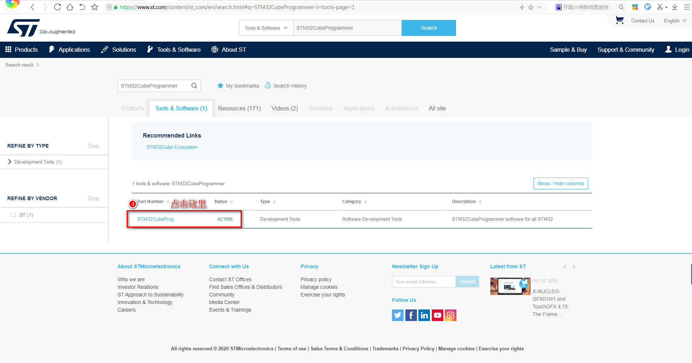

# 2.2 下载STM32CubeProgrammer

&emsp;&emsp;我们需要在Windows或者Linux下使用上位机通过USB Type-C连接线连接到ATK-STM32MP157开发板，然后进行烧写固件操作，所以我们就需要这样的上位机软件，它叫STM32CubeProgrammer，是由ST官方提供的，适用于烧写ST各种平台，现在我们只讲用USB Type-C连接方法烧写烧写固件到ATK-STM32MP157开发板的方法。

&emsp;&emsp;下载最新STM32CubeProgrammer，可以从ST官网https://www.st.com/下载。我们直接在浏览器打开官方网站，通过以下几步即可下载。

&emsp;&emsp;在如下位置输入STM32CubeProgrammer，然后点击搜索。（备注：我们需要在ST官方下载东西，需要注册ST帐号，请点击右上角登录或者注册进入注册。请自行注册，如果觉得麻烦，请直接使用我们此小节下载好的文档和软件，网盘路径为`开发板光盘A-基础资料->5、开发工具->2、ST官方开发工具`。）

 
图2.2 1在ST官网搜索STM32CubeProgrammer

&emsp;&emsp;等待搜索出结果，然后按下图位置点击

 
图2.2 2 选中STM32CubeProg

&emsp;&emsp;然后我们在下图页面选择最新版本下载

 
图2.2 3 点击Get Software(获取软件)

&emsp;&emsp;此时弹出一个条款，我们直接点击接受。

 
图2.2 4 接受条款

&emsp;&emsp;此时浏览器弹出下载对话框，我们也贴出en.stm32cubeprog_v2-5-0版本的下载链接（有可能ST官方会更新这个版本，请选择最新版本或者使用光盘里的版本），点击[这里](https://www.st.com/content/ccc/resource/technical/software/utility/group0/78/ce/00/5a/61/03/4e/eb/stm32cubeprog_v2-5-0/files/stm32cubeprog_v2-5-0.zip/jcr:content/translations/en.stm32cubeprog_v2-5-0.zip)，或者复制这个链接到迅雷下载。用迅雷下载更快，如果没有迅雷就直接点击下载吧（速度因个人网络而不同）。

 
图2.2 5 下载en.stm32cubeprog_v2-5-0

&emsp;&emsp;下载好了的安装包en.stm32cubeprog_v2-5-0.zip或者在网盘路径`开发板光盘A-基础资料->5、开发工具->2、ST官方开发工具`下找到en.stm32cubeprog_v2-5-0.zip。

&emsp;&emsp;然后我们进行解压，得到以下文件，第一个是MacOs系统下安装的文件，第二个是Windows下安装的exe文件，第三个是Linux下的执行安装程序。由于我们条件有限，只讲Windows和Linux下的STM32CubeProgrammer安装及使用。

 
图2.2 6 解压后的文件

