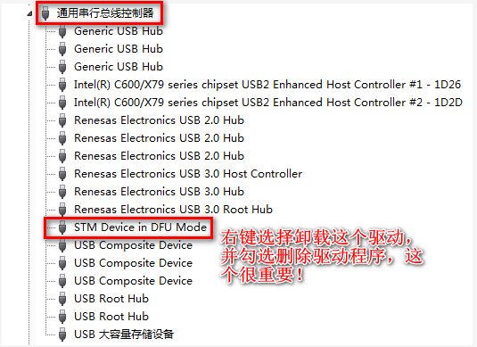

# 2.3 Windows下烧写固件到开发板

## 2.3.1 Windows安装STM32CubeProgrammer

&emsp;&emsp;小提示：Windows安装STM32CubeProgrammer比较麻烦，需要安装Java环境。用户需要有足够的耐心按操作进行安装！如果不想在Winodws下使用STM32CubeProgrammer，可以直接到2.4小节在Ubuntu上安装STM32CubeProgrammer，在Ubuntu使用STM32CubeProgrammer进行烧写固件。

&emsp;&emsp;在2.1小节获取STM32CubeProgrammer后，我们直接双击SetupSTM32CubeProgrammer-2.5.0.exe安装文件进行安装。如下图，提示需要安装1.8.0_66 - 10.99.99的Java运行环境。

 
图2.3.1 1提示需要安装Java

&emsp;&emsp;点击确定后，我们就会进入https://java.com/zh-CN/download/ Java官网下载，可以在网盘路径为`开发板光盘A-基础资料->3、软件->Java 安装包`下找到jre-8u261-windows-x64.exe(64位Java安装包)进行安装。

&emsp;&emsp;如下图我们进入到Java官网下载页面，按如图红色框框所选点击查看Java所有下载。**不要点击图中的同意并免费下载！切记！**

 
图2.3.1 2 点击查看所有Java下载

&emsp;&emsp;跳转到如下页面，请根据个人Winodws操作系统位数，下载对应版本的Java。作者使用的操作系统是64位的，所以选择64位的Java Windows脱机包下载。请根据个人的操作系统选择相应位数的Java版本，一定要对应位数。

 
图2.3.1 3请选择对应位数的Java下载

&emsp;&emsp;下载得到的文件，双击进行安装。

 
图2.3.1 4下载完成的64位Java安装包

&emsp;&emsp;Java安装界面，我们直接点击安装即可，默认安装路径即可，安装Java一般是不建议修改安装路径的，很多软件依赖Java就会到C盘找Java的路径！

 
图2.3.1 5 Java欢迎安装界面

&emsp;&emsp;正在安装如下图

 
图2.3.1 6正在安装

&emsp;&emsp;安装完成后，直接点击关闭

 
图2.3.1 7已经完成安装

&emsp;&emsp;安装完成后Java后，我们就可以直接安装STM32CubeProgrammer。双击安装SetupSTM32CubeProgrammer-2.5.0.exe进行安装。

&emsp;&emsp;安装弹出的欢迎安装界面，直接点击下一步。（此后的操作基本都是点击下一步即可）

 
图2.3.1 8 STM32CubeProgrammer欢迎安装界面

&emsp;&emsp;阅读STM32CubeProgrammer的信息，直接点下一步。

 
图2.3.1 9阅读相关信息

&emsp;&emsp;勾选同意license，点击下一步。

 
图2.3.1 10 同意条款，点下一步

&emsp;&emsp;请选择要安装的路径，个人可修改安装目录进行安装，再点击下一步。

 
图2.3.1 11 选择安装目录，点击下一步

&emsp;&emsp;勾选需要安装选项，我们直接默认即可，点击下一步。

 
图2.3.1 12 默认安装选项，点击下一步

&emsp;&emsp;正在安装。

 
图2.3.1 13 正在安装

&emsp;&emsp;安装期间会弹出是否要安装一些驱动，我们选择始终安装此驱动程序软件。

 
图2.3.1 14 安装时会询问是否信任此驱动

&emsp;&emsp;弹出驱动安装界面，点击下一步。

 
图2.3.1 15 点击下一步，安装此驱动

&emsp;&emsp;设备驱动安装完成，点击完成。

 
图2.3.1 16 驱动安装完成

&emsp;&emsp;安装完成后，直接点击下一步。

 
图2.3.1 17  STM32CubeProgrammer安装完成状态

&emsp;&emsp;默认会生成桌面快捷方式，我们点击下一步。

 
图2.3.1 18 点击下一步，生成STM32CubeProgrammer快捷方式

&emsp;&emsp;点击Done，完成安装。

 
图2.3.1 19 到此安装完成

&emsp;&emsp;桌面生成快捷方式如下。

 
图2.3.1 20 生成的桌面快捷方式

&emsp;&emsp;双击STM32CubeProgrammer快捷方式打开出现下面的界面，安装完成，工具软件正常运行。

 
图2.3.1 21 STM32CubeProgrammer启动后的界面

### 2.3.1.1 安装DFU驱动程序

&emsp;&emsp;ATK-STM32MP157开发板底板拨码为000即USB模式，（1为on，0为off，即拨码往上拨为1，拨码往下拨为0）。用USB Type-C连接开发板底板的USB_OTG接口再连接电脑的USB接口(**接USB 3.0，接USB2.0烧写很慢！**)，然后插上电源上电。上电过后会自动安装DFUSE驱动。

&emsp;&emsp;由于我们需要使用USB DFU模式，我们在安装STM32CubeProgrammer时Winodws 7默认会把DFUSE的驱动程序安装上去了。所以我们要在设备管理器里，找到通用串行总线控制器，找到STM Device in DFU Mode，下图为具有DfuSe 驱动程序的STM32 DFU器件。

&emsp;&emsp;经过实测，Windows 7会识别成如下，需要按下面的操作先卸载驱动。Windows10不用卸载驱动。

 
图2.3.1.1 1 Window 7需要卸载驱动 DfuSe驱动

&emsp;&emsp;然后我们找到STM32CubeProgrammer的安装路径，找到DFU_Driver文件夹，比如作者的是安装是E:\STM32CubeProgrammer\Drivers\DFU_Driver，如下，双击STM32Bootloader.bat进行安装具有STM32_Programmer 驱动程序的STM32 DFU。

 
图2.3.1.1 2 双击脚本进行安装驱动

&emsp;&emsp;再在设备管理器，点击操作->点击扫描检测硬件改动。驱动程序会自动安装上去了。

 
图2.3.1.1 3 扫描硬件改动，自动安装驱动

&emsp;&emsp;开发板使用USB模式最后被Windows 7识别为如下，具有STM32_Programmer 驱动程序的STM32 DFU 器件。

 
图2.3.1.1 4 Window 7识别驱动的名字

&emsp;&emsp;开发板使用USB模式最后被Windows 10识别为如下，具有STM32_Programmer 驱动程序的STM32 DFU 器件。

 
图2.3.1.1 5 Windows 10识别驱动的名字

&emsp;&emsp;出现如上，表明驱动安装正常。

## 2.3.2 Windows使用STM32CubePro烧写固件到eMMC

&emsp;&emsp;ATK-STM32MP157开发板插上电源，拨码开关选择为000（USB模式），将一根USB Type-C数据线连接到底板USB_OTG，再连接到PC（电脑）的USB 3.0接口（一般是内部是蓝色的就是USB 3.0接口，不要连接到USB 2.0接口，否则烧写很慢！

&emsp;&emsp;经过实测，如果烧写时间很长，说明您的USB 3.0接口可能不是真正的USB 3.0接口，实质是USB 2.0）。另一根USB Type-C数据线连接到底板USB_TTL（串口非必需连接，目的是观察一些打印信息）。然后开发板上电。

&emsp;&emsp;双击STM32CubeProgrammer桌面图标打开STM32CubeProgrammer界面。按如下步骤，选择设备类型为USB，点击刷新设备，刷新不出来可以按开发板上的RESET按钮（注意不要将此USB设备连接到Ubuntu虚拟机上去了）。如下图，出现USB1表明成功！

 
图2.3.2 1 识别出的USB1

&emsp;&emsp;按下图的步骤，打开烧录到eMMC的tsv配置文件，网盘路径为`STM32MP157开发板->开发板光盘A-基础资料->8、系统镜像->2、出厂系统镜像->1、STM32CubeProg烧录固件包->flashlayout`，STM32CubeProgrammer会读取此配置文件进行烧录固件到eMMC。

 
图2.3.2 2 选择eMMC烧写的配置文件

&emsp;&emsp;浏览固件所在目录，在网盘路径为`STM32MP157开发板->开发板光盘A-基础资料->8、系统镜像->2、出厂系统镜像->1、STM32CubeProg烧录固件包`。（用户经常在此出错，因为没选择到具体目录）

 
图2.3.2 3 浏览烧写文件的所在目录

&emsp;&emsp;确认连接信息，直接点击Download（下载）。注意，我们在2021年7月24日将Qt文件系统降级为Qt5.12.9，统一正点原子使用Qt的版本。如果您使用的是最新固件下图截图为`atk-image-qt.5.14.1-rootfs.ext4将会变成atk-image-qt5.12.9-rootfs.ext4`。除此之外，其他都一样！

 
图2.3.2 4 点击下载，开始烧写

&emsp;&emsp;正在烧写中，烧写过程中会重连接开发板，注意，如果您正在使用Ubuntu虚拟机，不要让开发板连接到Ubuntu虚拟机上去了。

 
图2.3.2 5 正在烧写

&emsp;&emsp;烧写的过程使用PC（电脑）USB3.0接口，烧写速度较快，约5~6分钟就可以烧写好整个系统。如果用户电脑没有USB 3.0接口，使用USB 2.0会相当慢（约40 ~60分钟）。我们平时在学习的过程中可以用来烧写tf-a、uboot和uImage是比较方便的。

&emsp;&emsp;如果不想更新文件系统就不烧写，我们可以编辑atk_emmc-stm32mp157d-atk-qt.tsv，将烧写文件系统的配置信息即最后一行，将“p”修改为“PE”，我们在ATK-STM32MP157的Linux驱动开发指南上有详细的解释。修改为“PE”即代表跳过，不烧写，如下。

 
图2.3.2 6 可跳过文件系统烧写

&emsp;&emsp;烧写完成如下图，拨码到010，eMMC启动即可。

 
图2.3.2 7 烧写完成

## 2.3.3 Windows使用STM32CubePro烧写固件到SD(TF)卡

&emsp;&emsp;请参考上面2.3.2小节烧写到eMMC的方法，选择atk_sdcard-stm32mp157d-atk-qt.tsv配置文件即可，记住烧写到TF卡，应要在底板上插上需要烧写的TF卡啊！

&emsp;&emsp;烧写完成后，拨码到101，SD卡（TF卡）启动即可。

