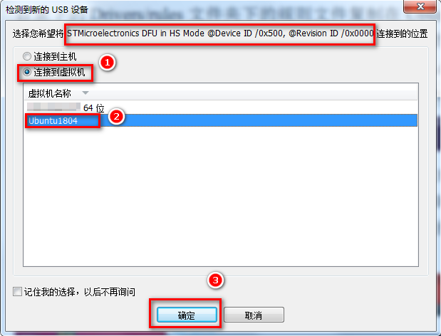
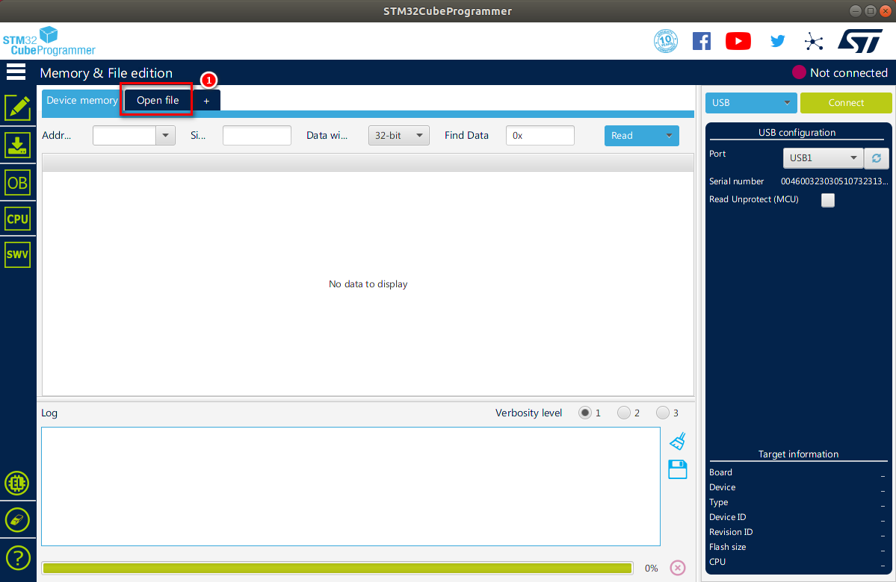
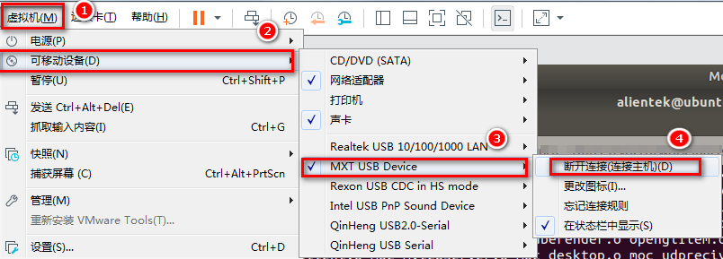

# 2.4 Linux下烧写固件到开发板

## 2.4.1 linux下安装STM32CubeProgrammer


&emsp;&emsp;拷贝2.2小节末尾内容所说的SetupSTM32CubeProgrammer-2.5.0.linux文件与SetupSTM32CubeProgrammer-2.5.0.exe这两个文件到Ubuntu上，本次使用的Ubuntu是18.04。使用其它版本与作者的安装环境不一样，如导致安装出错，请自行解决。

&emsp;&emsp;作者使用的是WinSCP拷贝到“家”目录下，如下

<center>
<br />
图2.4.1 1 拷贝文件到Ubuntu虚拟机
</center>

&emsp;&emsp;赋予SetupSTM32CubeProgrammer-2.5.0.linux可执行权限，执行下面的指令。

```c#
chmod +x SetupSTM32CubeProgrammer-2.5.0.linux
```

<center>
<br />
图2.4.1 2 赋予可执行权限
</center>

&emsp;&emsp;在介绍STM32CubeProgrammer时已经说过，在Linux下安装STM32CubeProgrammer也是需要安装Java的。执行下面的指令安装Java，我们直接安装openjdk-8-jre就可以了，不用安装openjdk-8-jdk。JDK包括JRE的，JRE是Java Runtime Environment的缩写，也就是Java运行的环境，我们只需要使用Java而不是开发Java，所以只安装openjdk-8-jre。

```c#
sudo apt-get install openjdk-8-jre
```

&emsp;&emsp;直接运行SetupSTM32CubeProgrammer-2.5.0.linux安装即可。

```c#
sudo ./SetupSTM32CubeProgrammer-2.5.0.linux  // 用户最好加sudo，和作者的环境一样，加sudo默认是安装到/usr/local/下。
```

&emsp;&emsp;安装步骤与2.3.1小节Windows的基本一样，请参考2.3.1小节，基本都是按下一步即可，安装的位置按软件的默认安装位置即可，不再重复安装步骤。

&emsp;&emsp;方法一：图标打开STM32CubeProgrammer

&emsp;&emsp;安装完成后会在桌面生成图标，如下图，这个图标我们双击它，（Ubuntu18.04环境）会弹窗提示，我们选择Trust & Launch（信任并启动）。


<center>
<br />
图2.4.1 3 未变化的桌面图标
</center>

&emsp;&emsp;图标就会变成如下，这时还不能直接双击打开，继续往下看。

<center>
<br />
图2.4.1 4 改变的桌面图标
</center>

&emsp;&emsp;方法二：命令行打开STM32CubeProgrammer

&emsp;&emsp;配置STM32CubeProgrammer的环境变量，这样我们就可以在命令行下使用指令打开这STM32CubeProgrammer。

&emsp;&emsp;编辑/etc/profile文件

```c#
sudo vi /etc/profile
```

&emsp;&emsp;在/etc/profile末尾添加以下内容，输入完成后按Esc，再按:wq保存退出。

```c#
export PATH=$PATH:/usr/local/STMicroelectronics/STM32Cube/STM32CubeProgrammer/bin/
```

<center>
<br />
图2.4.1 5 在末行写入环境变量
</center>

&emsp;&emsp;配置完成后，使能环境变量（每次启动前都需要source /etc/profile）

```c#
source /etc/profile
```

<center>
<br />
图2.4.1 6 使能环境变量
</center>

&emsp;&emsp;我们就可以在终端里使用指令打开

```c#
STM32CubeProgrammer
```

&emsp;&emsp;但是我们发现并不能开STM32CubeProgrammer的图形界面，原因是 ST 的 工具是运行在 Oracle 的 JRE上的，并不是运行在Open-JRE上，（网上说ST基于是JDK开发，这里作者只写运行环境）。所以我们还需要在Java官网上下载JRE。

&emsp;&emsp;在浏览器输入https://java.com/zh-CN/download/manual.jsp进入到Java的下载页面，根据个人的操作系统位数下载对应的Java。或者可直接在我们网盘路径`STM32MP157开发板->开发板光盘A-基础资料->3、软件->Java 安装包`下找到jre-8u261-linux-x64.tar.gz （64位Java安装包，光盘的版本可能有变动，可能不是8u261版本，请选择光盘里的版本）。


<center>
<br />
图2.4.1 7 下载相应位数的Linux Java
</center>


&emsp;&emsp;作者是64位Ubuntu，所以下载的是jre-8u261-linux-x64.tar.gz。拷贝jre-8u261-linux-x64.tar.gz到Ubuntu进入安装。

&emsp;&emsp;我们直接解压安装，输入如下指令，将它解压到我们Open-JRE的安装目录下。

```c#
sudo tar xf jre-8u261-linux-x64.tar.gz -C /usr/lib/jvm/
```

&emsp;&emsp;我们需要将这个JRE注册到系统里，指令最后的参数“1000”指的是优先级，可以随意设置。

```c#
sudo update-alternatives --install /usr/bin/java java /usr/lib/jvm/jre1.8.0_261/bin/java 1000
```

<center>
<br />
图2.4.1 8 将jRE注册到系统里
</center>

&emsp;&emsp;因为前面我们使用指令安装了Open-JRE，使用了Open-JRE，我们需要使用Oracle的JRE，我们需要切换使用的Java JRE。

&emsp;&emsp;输入下面的指令配置使用的Java JRE

```c#
sudo update-alternatives --config java
```

&emsp;&emsp;如下图，请确认手动安装的JRE是第几个，如下图，作者手动安装的JRE的编号为4，然后输入相应的数字按Enter键即可。


<center>
<br />
图2.4.1 9 选择系统要使用的Java
</center>

&emsp;&emsp;使用USB端口连接STM32器件，还需要在终端中输入以下命令来安装libusb1.0软件包。

```c#
sudo apt-get install libusb-1.0.0-dev
```

&emsp;&emsp;要使用ST-LINK工具或USB DFU连接到目标，您需要将位于STM32CubeProgrammer的安装目录下的Drivers/rules文件夹下的规则文件复制在Ubuntu上的/etc/udev/rules.d/文件夹中。

&emsp;&emsp;如果用户安装STM32CubeProgrammer时是使用默认安装目录则与作者的一样，直接使用下面的指令拷贝规则文件到Ubuntu上的/etc/udev/rules.d文件下。

```c#
sudo cp /usr/local/STMicroelectronics/STM32Cube/STM32CubeProgrammer/Drivers/rules/*.* /etc/udev/rules.d/
```

<center>
<br />
图2.4.1 10 拷贝相关驱动规则到相应目录
</center>

&emsp;&emsp;至此安装STM32CubeProgrammer完成，及安装驱动完成。

&emsp;&emsp;ATK-STM32MP157开发板插上电源，拨码开关选择为000（USB模式），将一根USB Type-C数据线连接到底板USB_OTG，再连接到PC（电脑）的**USB 3.0**接口（一般是内部是蓝色的就是USB 3.0接口，不要连接到USB 2.0接口，否则烧写很慢！经过实测，如果烧写时间很长，说明您的USB 3.0接口可能不是真正的USB 3.0接口，实质是USB 2.0）。另一根USB Type-C数据线连接到底板USB_TTL（串口非必需连接，目的是观察一些打印信息）。然后开发板上电。

&emsp;&emsp;注意：Ubuntu虚拟机要设置USB 兼容USB 3.0。如下图步骤，选择USB 3.0。

<center>
<br />
图2.4.1 11 虚拟机选择兼容USB 3.0
</center>

&emsp;&emsp;Ubuntu18.04虚拟机弹出以下窗口，我们将STMicroelectronic DFU in HS…(作者在Windows安装过STM32CubeProgrammer的DFU驱动，如果用户没安装过不一定是这个名字)。点击连接到虚拟机，选择接到Ubuntu 18.04（您的Ubuntu主机名）。再点击确认。

<center>
<br />
图2.4.1 12 连接器件到Ubuntu虚拟机
</center>

&emsp;&emsp;如果没弹出上面的窗口也没关系，直接在虚拟机（M）将STMicroelectronic DFU in HS…这个设备点击断开连接（连接到主机）（D）选项也可以连接这个设备到虚拟机。等等方法。

<center>
<br />
图2.4.1 13连接器件到Ubuntu虚拟机
</center>

&emsp;&emsp;双击STM32CubeProgrammer桌面图标打开，或者在终端使能环境变量后输入STM32CubeProgrammer打开STM32CubeProgrammer。按如下步骤，选择设备类型为USB，点击刷新设备，刷新不出来可以按开发板上的RESET按钮。如下图，出现USB1表明成功！

<center>
<br />
图2.4.1 14 连接成功，出现USB1
</center>

### 2.4.1.1 Linux使用STM32CubePro烧写固件到eMMC

&emsp;&emsp;按照上面的操作连接到开发板后，拷贝网盘路径`STM32MP157开发板->开发板光盘A-基础资料->8、系统镜像->2、出厂系统镜像->1、STM32CubeProg烧录固件包`，把这个“1、STM32CubeProg烧录固件包”文件夹到Ubuntu。如下图作者已经拷贝到Ubuntu的家目录下。

<center>
<br />
图2.4.1.1 1 拷贝烧录包到Ubuntu
</center>

&emsp;&emsp;点击如下图位置的Open file。

<center>
<br />
图2.4.1.1 2 打开文件
</center>

&emsp;&emsp;按下面的操作找到我们上面拷贝的1、STM32CubeProg烧录固件包文件夹的位置，进入flashlayout文件夹下，选择atk_emmc-stm32mp157d-atk-qt.tsv，再点击Open(打开)。

<center>
<br />
图2.4.1.1 3 选择烧录到eMMC的配置
</center>

&emsp;&emsp;点击Browser（浏览），定位到“1、STM32CubeProg烧录固件包”目录。如下

<center>
<br />
图2.4.1.1 4 选择烧录文件夹所在位置
</center>

&emsp;&emsp;确认选的是USB类型，已经将开发板与Ubuntu虚拟机连接，再点击Download（下载）。

<center>
<br />
图2.4.1.1 5 点击Download，开始烧录
</center>

&emsp;&emsp;可以看到如下，烧写正在进行，并打印烧写的信息。

<center>
<br />
图2.4.1.1 6 烧录进行中
</center>

&emsp;&emsp;一般如果没什么必要更新文件系统可不用烧写，我们可以在终端编辑atk_emmc-stm32mp157d-atk-qt.tsv，将烧写文件系统的配置信息即最后一行，将“p”修改为“PE”，我们在ATK-STM32MP157的Linux驱动开发指南上有详细的解释。修改为“PE”即代表跳过，不烧写。

<center>
<br />
图2.4.1.1 7 修改成“PE”，跳过文件系统烧写
</center>

&emsp;&emsp;烧写完成如下图，拨码到010，eMMC启动即可。

<center>
<br />
图2.4.1.1 8 烧写完成
</center>

### 2.4.1.2 Linux使用STM32CubePro烧写固件到SD(TF)卡

&emsp;&emsp;请参考上面2.4.1.1小节烧写到eMMC的方法，选择atk_sdcard-stm32mp157d-atk-qt.tsv配置文件即可，记住烧写到TF卡，应要在底板上插上需要烧写的TF卡啊！

&emsp;&emsp;烧写完成后，拨码到101，SD卡（TF卡）启动即可。

## 2.4.2 制作TF(SD)卡系统启动卡

&emsp;&emsp;我们可以使用在2.4.1.2小节里使用STM32CubeProgrammer来将系统烧录到TF卡这是一种方法，正点原子还提供另外一种方法，在Ubuntu里直接使用dd命令将一个系统烧写到TF卡，下面我们就介绍如何将ATK-STM32MP157的出厂系统在Ubuntu上烧录到TF卡上。

&emsp;&emsp;拷贝`开发板光盘A-基础资料->8、系统镜像->2、出厂系统镜像->2、TF(SD)卡或eMMC烧录固件包->1、sdcard_update`文件夹到Ubuntu虚拟机上如下，可使用（FileZilla或者WinSCP软件）拷贝到Ubuntu虚拟机下。

<center>
<br />
图2.4.2 1 拷贝文件夹到Ubuntu虚拟机下
</center>

&emsp;&emsp;使用读卡器插入TF卡（空白或者非空白的卡），连接到Ubuntu。按如下步骤，将TF卡连接到Ubuntu虚拟机（退出TF卡时再次点击图示的第4步，即可退出TF卡）。

<center>
<br />
图2.4.2 2 连接TF卡到Ubuntu虚拟机
</center>

&emsp;&emsp;使用fdisk查看TF卡设备。

```c#
sudo fdisk -l
```

&emsp;&emsp;编者使用的是一张16G大小的TF卡，一般TF卡都会识别成/dev/sdx设备（x=a,b,c,d…），一般/dev/sda通常是您的硬盘设备！请不要选择烧写到/dev/sda，否则您的Ubuntu虚拟机将无法启动。如下图，编者的TF卡被识别为/dev/sdb，看到容量为14.9 GiB（16G）说明就是编者的16GTF卡。

<center>
<br />
图2.4.2 3 确认TF卡的设备节点
</center>

&emsp;&emsp;赋予脚本可执行权限

```c#
chmod +x sdcard_update.sh
```

&emsp;&emsp;确认了TF卡的设备节点后，开执行脚本开始烧录到TF卡，注意，烧录的过程会把整张TF卡格式化，如有重要数据，请先备份好重要数据！

```c#
sudo ./sdcard_update.sh /dev/sdb
```

&emsp;&emsp;烧写过程如下图，可以看到烧写的耗时及速度，过程不要中断，直到脚本自动退出为止。本次耗时175s，约3分钟仅供参考，烧写速度与个人的TF卡写速度有关。

<center>
<br />
图2.4.2 4 TF卡启动系统烧写完成
</center>

&emsp;&emsp;烧写完成后按上面连接TF卡的方法，退出TF卡。将TF卡插到ATK-STM32MP157底板卡槽上，拨码至101，上电启动即可！

## 2.4.3 使用TF(SD)卡启动烧写固件到eMMC

&emsp;&emsp;在2.4.2小节制作好TF卡系统后，我们从TF卡启动系统，开发板拨码为010。从**TF卡启动系统后**，将要烧写到eMMC的文件夹拷贝到开发板文件系统下。如下图，要想在windows下使用scp指令通过网络拷贝文件到开发板，需要在windows下装git，安装方法不细说了，直接百度“Git for Windows”，下载后默认安装即可，这个比较基础，然后右键进入git bash命令行终端。作者用scp指令将资料下的`开发板光盘A-基础资料->8、系统镜像->2、出厂系统镜像->2、TF(SD)卡或eMMC烧录固件包`的`2、emmc_update`文件夹拷贝到开发板/home/root下，其中192.168.1.149为编者个人开发板的ip地址，请修改为用户自己的开发板ip，参考下面指令进行拷贝到开发板系统/home/root目录下。

```c#
scp -r 2、emmc_update/ root@192.168.1.149:/home/root
```

&emsp;&emsp;如下图编者已经拷贝2、emmc_update整个文件夹到/home/root目录下。使用cd命令进入2、emmc_update后，如下。

<center>
<br />
图2.4.3 1 拷贝烧录文件到开发板/home/root目录下
</center>

&emsp;&emsp;赋予emmc_update.sh可执行权限（如果可以执行，就不用再赋予这个权限了）

```c#
chmod +x emmc_update.sh
```

&emsp;&emsp;执行下面的指令，烧写系统到核心板上的eMMC储存上。

```c#
./emmc_update.sh /dev/mmcblk2
```

&emsp;&emsp;烧写完成如下图，这样就可以把固件烧写到核心eMMC存储上了。

<center>
<br />
图2.4.3 2 eMMC启动烧写完成
</center>


