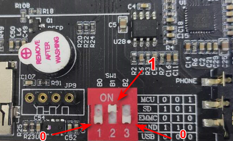

# 3.3 拨码开关设置及登录开发板

&emsp;&emsp;ATK-STM32MP157的拨码开关支持以下模式，下图是开发板底板BOOT原理图。

 
图3.3 1 底板原理图上的BOOT

&emsp;&emsp;由开发板底板原理图可知 
&emsp;&emsp;（1）	MCU（Cortex M4）的模式拨码为100 
&emsp;&emsp;（2）	SD Card启动模式拨码为101 
&emsp;&emsp;（3）	NOR 启动模式拨码为101 （ATK-STM32MP157没NOR FLASH设备） 
&emsp;&emsp;（4）	EMMC启动模式拨码为010 
&emsp;&emsp;（5）	NAND启动模式拨码为011 （ATK-STM32MP157不售NAND FLASH类型核心板） 
&emsp;&emsp;（6）	USB/UART模式拨码为110/000

&emsp;&emsp;ATK-STM32MP157开发板底板使用一根USB Type-C连接线，连接底板上的USB_TTL接口，另一端连接到PC(电脑)的USB接口，出厂时已经把Linux系统烧写到核心板上的eMMC存储上了。所以我们将拨码拨至010，如下图，拨码打上表示为“1”（ON），打下表示为“0”(OFF)。

 
图3.3 2 eMMC启动拨码方式

&emsp;&emsp;开发板插上6-16V直流电源，MobaXterm选择为串口类型，按如下设置。请选择相应的COM口（COM口是PC（电脑）识别开发板USB_TTL的串口号）。

 
图3.3 3 MobaXterm串口设置

&emsp;&emsp;开发板从eMMC模式启动后，串口终端打印tf-a、Uboot和内核的启动信息，如下。

 
图3.3 4 开发板启动串口打印的信息

&emsp;&emsp;出厂文件系统由ST提供的Yocto编译制作而成，启动时间较长，因为出厂文件系统需要启动的服务较多（非简易文件系统），如有LCD屏或HDMI，在登录开发板后Qt界面还需要几秒后才能启动，因为Qt界面应用程序比较大，需要启动一段时间。

&emsp;&emsp;串口终端无需输入密码，默认以root用户自动登录。用户名为“root”。登录后串口终端如下图。

 
图3.3 5 串口终端打印登录开发板的信息

