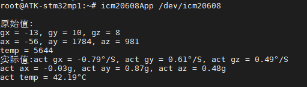

# 4.10 ICM20608测试


<div class="stm32mp157_center-table-div">
<table class="stm32mp157_center-table">
  <tr>
    <th>STM32MP157</th>
    <th>MINI STM32MP157</th>
  </tr>
  <tr>
    <td>支持</td>
    <td>不支持</td>
  </tr>
</table>
</div>


&emsp;&emsp;ICM-20608简介：

&emsp;&emsp;ICM-20608 是 InvenSense 出品的一款 6 轴 MEMS 传感器，包括 3 轴加速度和 3 轴陀螺仪。

&emsp;&emsp;ICM-20608 尺寸非常小，只有 3x3x0.75mm，采用 16P 的 LGA 封装。ICM-20608 内部有一个 512字节的 FIFO。陀螺仪的量程范围可以编程设置，可选择±250，±500，±1000 和±2000°/s，加速度的量程范围也可以编程设置，可选择±2g，±4g，±4g，±8g 和±16g。陀螺仪和加速度计都是 16 位的 ADC，并且支持 I2C 和 SPI 两种协议，使用 I2C 接口的话通信速度最高可以达到 400KHz，使用 SPI 接口的话通信速度最高可达到 8MHz。I.MX6U-ALPHA 开发板上的 ICM-20608 通过 SPI 接口和 I.MX6U 连接在一起。ICM-20608 特性如下：

&emsp;&emsp;①、陀螺仪支持 X，Y 和 Z 三轴输出，内部集成 16 位 ADC，测量范围可设置：±250，±500，±1000 和±2000°/s。<br />
&emsp;&emsp;②、加速度计支持 X，Y 和 Z 轴输出，内部集成 16 位 ADC，测量范围可设置：±2g，±4g，±4g，±8g 和±16g。<br />
&emsp;&emsp;③、用户可编程中断。<br />
&emsp;&emsp;④、内部包含 512 字节的 FIFO。<br />
&emsp;&emsp;⑤、内部包含一个数字温度传感器。<br />
&emsp;&emsp;⑥、耐 10000g 的冲击。<br />
&emsp;&emsp;⑦、支持快速 I2C，速度可达 400KHz。<br />
&emsp;&emsp;⑧、支持 SPI，速度可达 8MHz。

&emsp;&emsp;ICM20608元器件在ATK-STMMP157底板上的位置如下

<center>
<br />
图4.10 1 ICM20608在开发板的位置
</center>

&emsp;&emsp;ATK-STMMP157底板上使用 SPI1 接口连接了一个六轴传感器 ICM-20608，由正点原子提供linux驱动程序与用户测试程序。驱动路径为出厂源码/drivers/char/icm20608.c，设备树arch/arm/boot/dts/stm32mp157d-atk.dtsi配置如下：

```c#
&spi1 {
   pinctrl-names = "default", "sleep";
   pinctrl-0 = <&spi1_pins_a>;
   pinctrl-1 = <&spi1_sleep_pins_a>;
   cs-gpio = <&gpioz 3 GPIO_ACTIVE_LOW>;
   status = "okay";

        spidev: icm20608@0 {
        compatible = "alientek,icm20608";
        #address-cells = <1>;
        #size-cells = <0>;
        reg = <0>; /* CS #0 */
        spi-max-frequency = <8000000>;
    };
};
```

&emsp;&emsp;其中我们向出厂文件系统添加了用户测试程序icm20608App，放在了/usr/bin/目录下。所以我们可以在文件系统直接执行icm20608App来获取六轴传感器的数据。

&emsp;&emsp;执行下面指令安装驱动程序，防止驱动程序有可能没有装上（如果有做了修改禁止启动Qt桌面的操作，或者没带显示，Qt桌面就不会去加载icm20608驱动程序）

```c#
modprobe icm20608
```

&emsp;&emsp;执行指令获取六轴传感器的数据，按Ctrl + c停止

```c#
icm20608App /dev/icm20608
```

<center>
<br />
图4.10 2 读取ICM20608数据
</center>
