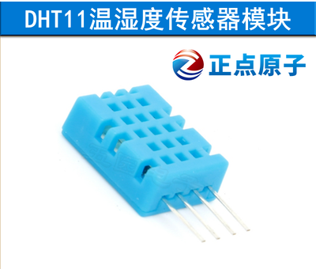
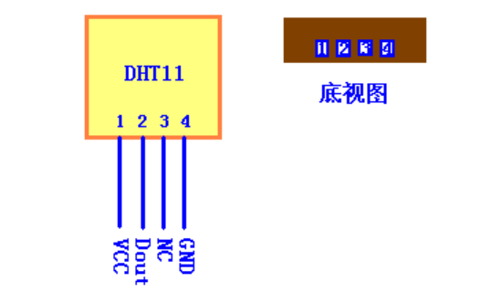
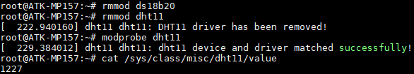

# 4.12 DHT11测试

&emsp;&emsp;DHT11简介：

&emsp;&emsp;DHT11 是一款湿温度一体化的数字传感器。该传感器包括一个电阻式测湿元件和一个 NTC测温元件，并与一个高性能 8 位单片机相连接。通过单片机等微处理器简单的电路连接就能够实时的采集本地湿度和温度。DHT11 与单片机之间能采用简单的单总线进行通信，仅仅需要一个 I/O 口。传感器内部湿度和温度数据 40Bit 的数据一次性传给单片机，数据采用校验和方式进行校验，有效的保证数据传输的准确性。DHT11 功耗很低，5V 电源电压下，工作平均最大电流 0.5mA。正点原子也提供了Linux下的驱动，方便大家测试与学习。程序仅供参考。

&emsp;&emsp;此实验需要准备DHT11模块，可在正点原子淘宝店或者其他渠道购买。


<center>
<br />
图4.12 1 DHT11模块
</center>

&emsp;&emsp;正点原子淘宝DHT11的技术参数如下：<br />
&emsp;&emsp; -	工作电压范围：3.3V-5.5V<br />
&emsp;&emsp; -	工作电流： 平均0.5mA<br />
&emsp;&emsp; -	输出：单总线数字信号<br />
&emsp;&emsp; -	测量范围：湿度 20~90％RH，温度 0~50℃<br />
&emsp;&emsp; -	精度 ：湿度±5%，温度±2℃<br />
&emsp;&emsp; -	分辨率 ：湿度 1%，温度 1℃

&emsp;&emsp;DHT11模块的管脚排列如下图，下图为正面视图，有孔的一面为正面。

<center>
<br />
图4.12 2 DHT11正视图与底视图
</center>

&emsp;&emsp;ATK-STM32MP157底板上JP9处，也就是拨码开关旁边，留出了一个单排圆孔母座4Pin的座子。可用于连接DHT11或者DS18B20。按JP9处丝印可知道如何把DHT11插到JP9上（传感器有正面有孔的一面朝向开发板外侧）。注意不要插错方向。
由正点原子提供DHT11驱动程序，出厂内核源码路径为drivers/char/dht11.c。设备树arch/arm/boot/dts/stm32mp157d-atk.dtsi配置如下：

```c#
/ {
// … 此处省略其他配置
    dht11 {
        compatible = "alientek,dht11";
        dht11-gpio = <&gpiof 2 GPIO_ACTIVE_LOW>;
        status = "okay";
};
// … 此处省略其他配置
};
```

&emsp;&emsp;因为4.13小节的DS18B20与DHT11是共用一个管脚，它们两者的驱动正点原子都已经提供。但是两者不能同时同一个管脚，否则会提示加载驱动失败。

&emsp;&emsp;开发板启动前请在JP9处插好DHT11模块，亦可在启动后再插上。因为DS18B20与DHT11驱动加载可能有先后顺序，所以它们在驱动注册时申请同一个管脚时会有一个驱动加载失败。所以我们可以在文件系统命令行下重新加载对应的驱动即可！
使用DHT11模块时，先卸载DS18B20的驱动，再重新加载DHT11的驱动。

```c#
rmmod ds18b20       //卸载DS18B20的驱动
rmmod dht11         //卸载DHT11的驱动 
modprobe dht11      //安装DHT11的驱动
```

&emsp;&emsp;使用下面的指令获取DHT11模块的数据。如下图：前两位数字是湿度数据，后面两位是温度数据，如若获取到只有三位数据或者两位数据，请自行根据所在环境判断，或者修改驱动来改写打印的格式即可。驱动仅供参考。

```c#
cat /sys/class/misc/dht11/value
```

<center>
<br />
图4.12 3 读取DHT11的数据
</center>

&emsp;&emsp;上面读出来的数据是12％RH，27℃