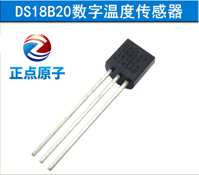
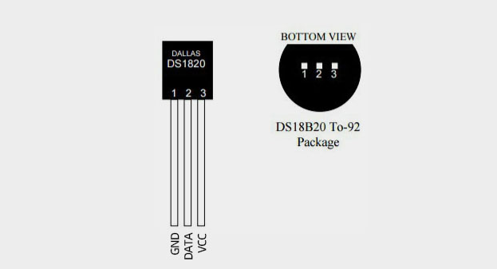
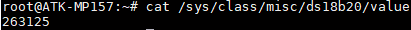

# 4.13 DS18B20测试

&emsp;&emsp;DS18B20简介：<br />
&emsp;&emsp;DS18B20 是由 DALLAS 半导体公司推出的一种的“一线总线”接口的温度传感器。与传统的热敏电阻等测温元件相比，它是一种新型的体积小、适用电压宽、与微处理器接口简单的数字化温度传感器。一线总线结构具有简洁且经济的特点，可使用户轻松地组建传感器网络，从而为测量系统的构建引入全新概念，测量温度范围为-55~+125℃ ，精度为±0．5℃。3-5.5 V 的电压范围，采用多种封装形式，从而使系统设计灵活、方便等。

&emsp;&emsp;此实验需要准备DS18B20模块，可在正点原子淘宝店或者其他渠道购买。


<center>
<br />
图4.13 1 DS18B20模块
</center>

&emsp;&emsp;DS18B20模块的管脚排列如下图， 以正视图为准。

<center>
<br />
图4.13 2 DS18B20正视图与俯视图
</center>

&emsp;&emsp;ATK-STM32MP157底板上JP9处，也就是拨码开关旁边，留出了一个单排圆孔母座4Pin的座子。可用于连接DS18B20或者DHT11。按JP9处丝印可知道如何把DS18B20插到JP9上。将DS18B20半圆的一面，对准底板上丝印半圆的三个脚，半圆是朝向开发板外侧。注意不要插错方向，否则将DS18B20烧掉。如果感觉DS18B20开始发热，请迅速断电，否则将烧掉DS18B20。

&emsp;&emsp;由正点原子提供DHT11驱动程序，出厂内核源码路径为drivers/char/ds18b20.c。设备树arch/arm/boot/dts/stm32mp157d-atk.dtsi配置如下：

```c#
/ {
// … 此处省略其他配置
    ds18b20 {
        compatible = "alientek,ds18b20";
        ds18b20-gpio = <&gpiof 2 GPIO_ACTIVE_LOW>;
        status = "okay";
    };
// … 此处省略其他配置
};
```

&emsp;&emsp;开发板启动前请在JP9处插好DS18B20，亦可在启动后再插上。因为DS18B20与DHT11驱动加载可能有先后顺序，所以它们在驱动注册时申请同一个管脚时会有一个驱动加载失败。所以我们可以在文件系统命令行下重新加载对应的驱动即可！

&emsp;&emsp;使用DS18B20时，先卸载DHT11的驱动，再重新加载DS18B20的驱动。

```c#
rmmod dht11              //卸载DHT11的驱动
rmmod ds18b20            //卸载DS18B20的驱动 
modprobe ds18b20         //安装DS18B20的驱动
```

&emsp;&emsp;使用下面的指令获取DS18B20的数据，得出来的数值除以10000，就是实际的温度数据。

```c#
cat /sys/class/misc/ds18b20/value
```

<center>
<br />
图4.13 3 读取DS18B20的数据
</center>

