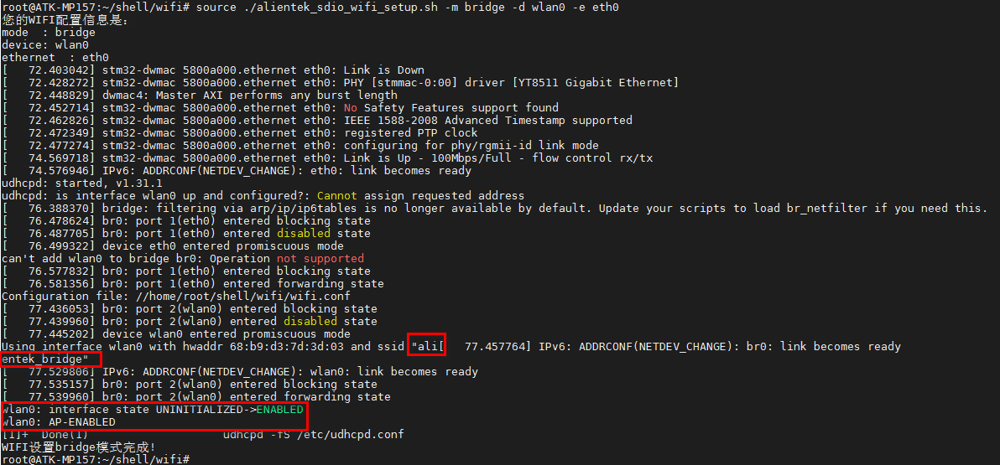

# 4.14 板载SDIO WIFI测试

<div class="stm32mp157_center-table-div">
<table class="stm32mp157_center-table">
  <tr>
    <th>STM32MP157</th>
    <th>MINI STM32MP157</th>
  </tr>
  <tr>
    <td>支持</td>
    <td>不支持</td>
  </tr>
</table>
</div>


&emsp;&emsp;ATK-STM32MP157使用的SDIO类型是RTK-8723DS。

&emsp;&emsp;开始实验时，请检查板子上的天线，也就是USB接口旁边的天线是否拧好拧紧。记得插上12v电源！不能只用串口连接线供电。

## 4.14.1 上网（Station）模式测试

&emsp;&emsp;扫描WIFI热点，使用文件系统提供的iw指令可扫描出热点名称。如果要查看完整的热点信息，先开启wlan0，使用iw wlan0 scan指令，这里使用grep过滤掉了一些信息。

```c#
ifconfig wlan0 up
iw wlan0 scan | grep SSID
```

&emsp;&emsp;如下图扫描出热点名称“ZZK”，其中“x00\x00\...”是因为带中文字符显示不出来。所以用户的热点最好是由英文字符组成。


<center>
<br />
图4.14.1 1 搜索到的热点
</center>

&emsp;&emsp;编辑要连接的热点信息，将/etc/wpa_supplicant.conf修改成如下,输入:wq保存退出。请修改个人热点的ssid，及psk。

&emsp;&emsp;解释：<br />
&emsp;&emsp; -	ssid 为无线网络名称
&emsp;&emsp; -	psk 为无线网络密码

```c#
vi /etc/wpa_supplicant.conf
```

&emsp;&emsp;输入以下内容。

```c#
ctrl_interface=/var/run/wpa_supplicant
ctrl_interface_group=0
update_config=1

network={
        ssid="ZZK"
psk="1590202****"
}
```

&emsp;&emsp;如果热点是无密码的则需要将/etc/wpa_supplicant.conf，改成如下

```c#
ctrl_interface=/var/run/wpa_supplicant
ctrl_interface_group=0
update_config=1

network={
        ssid="ZZK"
        key_mgmt=NONE
}
```

<center>
<br />
图4.14.1 2 配置/etc/wpa_supplicant.conf
</center>

&emsp;&emsp;执行下面的指令连接热点及获取ip。

```c#
wpa_supplicant -Dnl80211 -c /etc/wpa_supplicant.conf -i wlan0 &
udhcpc -i wlan0
```

<center>
<br />
图4.14.1 3 连接成功，获取到ip
</center>

&emsp;&emsp;看到如上结果，已经连接到WIFI热点，及获取到ip信息。

&emsp;&emsp;也可以用ifconfig指令查看我们的wlan0所获取的ip地址。


<center>
<br />
图4.14.1 4 查看获取到的ip地址
</center>

&emsp;&emsp;ping百度测试连通性，也可以ping网关来测试WIFI的连通性。**备注：如果ping不通百度，请重启开发板，不要插网线，重新连接WIFI即可！因为系统会默认只让一个网络设备连通外网。**

```c#
ping www.baidu.com -I wlan0
ping 192.168.1.1 -I wlan0
```

<center>
<br />
图4.14.1 5 ping百度测试
</center>

&emsp;&emsp;同时，如果觉得上面的连接方法过于繁琐，正点原子也提供了脚本可直接输入WIFI热点名称及密码即可连接WIFI，这就是脚本的好处，可以把重复的工作放于脚本里。
进入/home/root/shell/wifi目录下。可以看到alientek_sdio_wifi_setup.sh脚本，脚本内容仅供参考。

```c#
cd /home/root/shell/wifi 	
ls
```

<center>
<br />
图4.14.1 6 WIFI连接脚本的位置
</center>

&emsp;&emsp;下面介绍脚本的用法，输入./alientek_sdio_wifi_setup.sh -h

```c#
./alientek_sdio_wifi_setup.sh -h
```

<center>
<br />
图4.14.1 7 查看脚本使用方法
</center>

&emsp;&emsp;根据用法帮助，所以我们可以这样连接WIFI热点。

&emsp;&emsp; -	ZZK: WIFI热点的名称，请根据个人的热点修改此值，注意使用该脚本时中文热点名或者有空格的热点名不生效。

&emsp;&emsp; - 1590202****: WIFI热点的密码，请根据个人的热点修改此值

```c#
source ./alientek_sdio_wifi_setup.sh -m station -i ZZK -p 1590202**** -d wlan0
```

<center>
<br />
图4.14.1 8 连接成功，及获取到ip地址
</center>

&emsp;&emsp;可以看到已经连接上，及获取到IP了，剩余的测试连通性操作与上面的一样。

## 4.14.2 热点（SoftAP）模式测试

&emsp;&emsp;我们可以把板子上的SDIO WIFI开启热点，让其他手机（或者其他板子）连接到这个热点上。这样可以将手机（或其他板子）与开发板连接，构成一个局域网，可以通过TCP、UDP等与ATK-STM32MP157板子进行通信。如果不了解什么是TCP和UDP通信，建议自行找资料看看。

&emsp;&emsp;直接在我们上一步的目录/home/root/shell/wifi执行如下指令

```c#
source ./alientek_sdio_wifi_setup.sh -m softap -d wlan0
```

<center>
<br />
图4.14.2 1 发出的热点名称
</center>

&emsp;&emsp;如上，可以看到开启的热点名称为“alientek_softap”，默认密码为12345678。要修改热点名称和密码，请自行打开alientek_sdio_wifi_setup.sh脚本修改即可。

&emsp;&emsp;手机输入密码连接后，即可连接，开发板将自动为手机分配IP（请更新到v1.2版本以上文件系统，体验）。连接成功后，有的手机会判断这个网络是无法访问互联网的状态，会询问您是否要保持这个网络连接，我们点击保持连接即可！

&emsp;&emsp;连接成功如下图，之后可以使用出厂系统Qt UI，TCP及UDP与手机进行互相发消息了！手机端请下载的TCP通信相关软件。

<center>
<br />
图4.14.2 2 手机已连接板载WIFI发出的热点
</center>

## 4.14.3 桥接（Bridge）模式测试

&emsp;&emsp;进行桥接模式前请确认底板网口已经插上网线，并且能通过网线上网！原理是底板WIFI开启热点，将热点桥接到网口上，手机可以连接上这个热点进行上网。

&emsp;&emsp;执行下面的指令开启桥接模式。如果上面已经开启了热点模式，想切换到桥接模式，那么我们需要执行两次下面的指令，防止切换桥接模式不成功。热点名称为“alientek_bridge”，密码为“12345678”。手机就可以连接上这个热点上网了！

```c#
source ./alientek_sdio_wifi_setup.sh -m bridge -d wlan0 -e eth0
```

<center>
<br />
图4.14.3 1 开启桥接模式
</center>

&emsp;&emsp;手机连接此热点，自动获取ip后就可以上网了。如果家中有网线没路由器，可以借此开发板开启热点来使用啦！

&emsp;&emsp;手机连接如下图。

<center>
<br />
图4.14.3 2 手机连接桥接模式的热点
</center>


