# 4.15 板载蓝牙测试

<div class="stm32mp157_center-table-div">
<table class="stm32mp157_center-table">
  <tr>
    <th>STM32MP157</th>
    <th>MINI STM32MP157</th>
  </tr>
  <tr>
    <td>支持</td>
    <td>不支持</td>
  </tr>
</table>
</div>


&emsp;&emsp;ATK-STM32MP157使用的蓝牙芯片类型是RTK-8723DS，蓝牙初始化时会加载文件系统/lib/firmware/rtlbt/目录下的固件。

## 4.15.1 蓝牙初始化

&emsp;&emsp;要想进行蓝牙测试，必须使用下面的指令进行蓝牙初始化。为了防止蓝牙未完全复位，我们向内核申请一个gpio（这个gpio硬件连接到蓝牙的复位管脚上），设置为输出方向，先给一个低电平，再给一个高电平，这样就可以给蓝牙复位了。

```c#
echo 90 > /sys/class/gpio/export				
echo out > /sys/class/gpio/gpio90/direction
echo 0 > /sys/class/gpio/gpio90/value
sleep 1
echo 1 > /sys/class/gpio/gpio90/value
rtk_hciattach -n -s 115200 /dev/ttySTM3 rtk_h5 &
systemctl start bluetooth.service
```

&emsp;&emsp;解释：<br />
&emsp;&emsp;（1）	rtk_hciattach：初始化蓝牙的工具，此工具只适用于ATK-STM32MP157。<br />
&emsp;&emsp;（2）	115200：通信比特率，只支持115200。<br />
&emsp;&emsp;（3）	/dev/ttySTM3：串口设备。<br />
&emsp;&emsp;（4）	rtk_h5：rtk_hciattach的传参蓝牙类型。<br />
&emsp;&emsp;（5）	systemctl start bluetooth.service开启蓝牙服务。

&emsp;&emsp;初始化时会打印许多信息，编者蓝牙初始化脚本atk-bluetooth-init.sh，放在/home/root/shell/bluetooth下。我们先进入/home/root/shell/bluetooth目录。然后执行此脚本即可初始化蓝牙，并开启了蓝牙服务。

```c#
cd /home/root/shell/bluetooth
./atk-bluetooth-init.sh
```

<center>
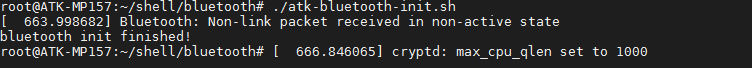<br />
图4.15.1 1 初始化板载蓝牙成功
</center>

## 4.15.2 蓝牙传输文件

&emsp;&emsp;在4.15.1小节蓝牙初始化成功后，我们要开启蓝牙。使用下面的指令开启蓝牙。

```c#
hciconfig hci0 up
hciconfig hci0 piscan 	// 开启蓝牙被扫描
```

<center>
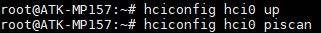<br />
图4.15.2 1 打开蓝牙
</center>

&emsp;&emsp;解释：<br />
&emsp;&emsp;（1）	hciconfig：蓝牙工具，用于配置蓝牙<br />
&emsp;&emsp;（2）	hci0：蓝牙网络节点名称<br />
&emsp;&emsp;（3）	up：打开蓝牙，如果设置为down表示关闭蓝牙

&emsp;&emsp;使用下面指令扫描蓝牙设备，用户先打开手机蓝牙，再使用如下指令扫描。

```c#
hcitool scan
```

<center>
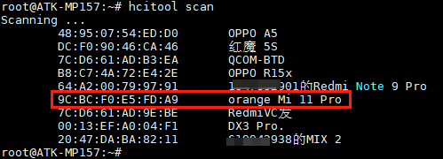<br />
图4.15.2 2 扫描到手机蓝牙设备
</center>

&emsp;&emsp;开启obexd守护进程，设置接收的目录为/home/root/

```c#
/usr/libexec/bluetooth/obexd -r /home/root -a -d &
```

<center>
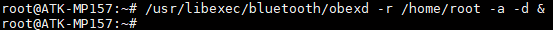<br />
图4.15.2 3 开启obexd守护进程
</center>

&emsp;&emsp;参数解释：<br />
&emsp;&emsp;（1）	-r：设置用于接收的路径<br />
&emsp;&emsp;（2）	-a：设置自动接收<br />
&emsp;&emsp;（3）	-d：打印debug信息

&emsp;&emsp;开启命令行测试工具obexctl

```c#
obexctl
```

<center>
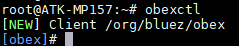<br />
图4.15.2 42 进入obexctl交互命令行
</center>

&emsp;&emsp;看到以上结果表明，开启obex成功，并进入了交互命令行

### 4.15.2.1 蓝牙发送文件

&emsp;&emsp;执行下面的指令连接手机，在4.15.2小节里我们已经扫描手机蓝牙，输入下面的指令进行连接手机，格式为 connect [MAC]

```c#
connect XX:XX:XX:XX:XX:XX  //请输入个人的手机蓝牙MAC地址
```

<center>
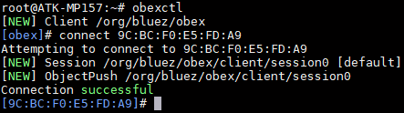<br />
图4.15.2.1 1 连接蓝牙
</center>

&emsp;&emsp;发送文件到手机，比如/usr/local/src/audio目录下有一个1.mp3文件，（注意传输的文件名称或者类型，同名文件等可能被手机重命名，某些类型的文件可能不能被手机接收）我们将它发送到手机，如下

```c#
send /usr/local/src/audio/1.mp3
```

<center>
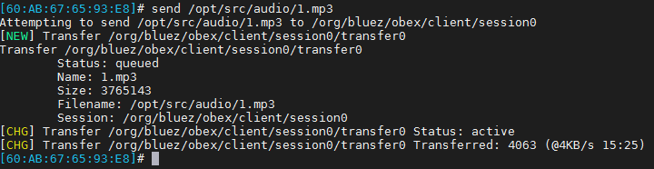<br />
图4.15.2.1 2 发送文件
</center>

&emsp;&emsp;手机弹窗显示，是否接收来自开发板的1.mp3文件，点击接受后，可在手机任务栏上查看蓝牙的传输进度。

<center>
<br />
图4.15.2.1 3 来自开发板的mp3文件
</center>

<center>
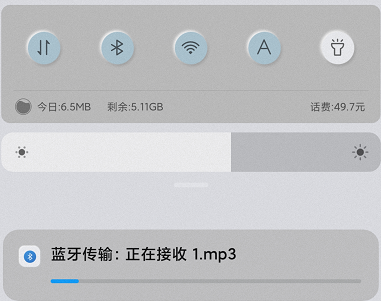<br />
图4.15.2.1 4 正在接收来自开发板的mp3文件
</center>

&emsp;&emsp;开发板上串口终端打印如下。

<center>
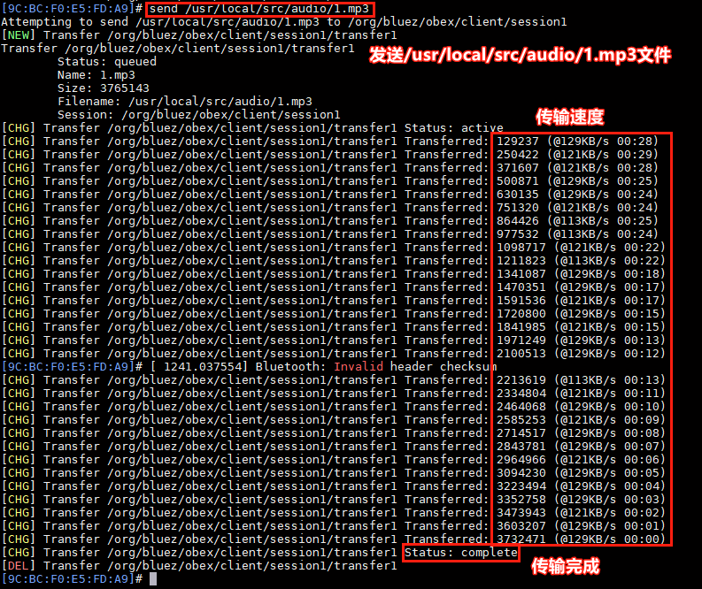<br />
图4.15.2.1 5 开发板蓝牙传输文件打印的信息
</center>

&emsp;&emsp;传输完成后可以在手机上查看到传过来的文件，如下。

<center>
<br />
图4.15.2.1 6 手机上接收到的mp3文件
</center>

### 4.15.2.2 蓝牙接收文件

&emsp;&emsp;在4.15.1小节初始化蓝牙后，在4.15.2.1小节开启了obexd守护进程并设置了蓝牙的接收目录。所以我们可以在手机选择要发送的文件点击发送，选择蓝牙发送，然后再选择我们的开发板的蓝牙设备。如下。

<center>
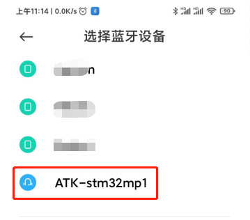<br />
图4.15.2.2 1 手机搜索到开发板的蓝牙
</center>

&emsp;&emsp;选择发送后 ，可以在手机任务栏查看发送的进度，本次编者发送了一张图片

<center>
<br />
图4.15.2.2 2 手机可查看到传输进度
</center>

&emsp;&emsp;传输完成，开发板打印如下。


<center>
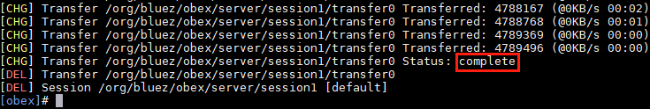<br />
图4.15.2.2 3 终端打印传输完成
</center>

## 4.15.3 蓝牙建立连接(蓝牙音乐)

&emsp;&emsp;在4.1.15.1小节初始化蓝牙后 ，我们要开启蓝牙。使用如下指令

```c#
hciconfig hci0 up
```

&emsp;&emsp;使用bluetoothctl进入蓝牙命令交互行

<center>
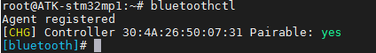<br />
图4.15.3 1 进入bluetoothctl蓝牙命令交互行
</center>

&emsp;&emsp;输入下面的指令进行蓝牙连接手机蓝牙的MAC，XX:XX:XX:XX:XX:XX。更多指令的用法，可输入help来查看。

```c#
power on                       //开启电源
agent on                       //开启代理，默认是开启的
scan on                        //开始扫描，或者已经知道蓝牙的MAC，可不用扫描
scan off                       //等待扫描出手机蓝牙MAC，后关闭
pairable on                    //开启蓝牙被扫描
connect XX:XX:XX:XX:XX:XX      //连接蓝牙，XX:XX:XX:XX:XX:XX代表目标蓝牙
exit                           //连接成功后退出交互界面
```

&emsp;&emsp;下图是省略输入scan on和scan off指令，因为在4.15.2小节作者已经知道本人手机蓝牙MAC。在手机端连接开发板蓝牙，并配对验证码。

<center>
<br />
图4.15.3 2 配对验证码
</center>

&emsp;&emsp;然后在开发板端确认验证码，如下图。

<center>
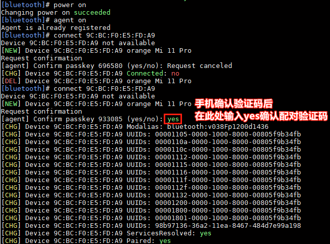<br />
图4.15.3 3 确认配对验证码
</center>

&emsp;&emsp;输入exit退出bluetoothctl命令行交互后，至此我们已经与手机蓝牙建立了连接。在手机上可以看到开发板蓝牙识别成一个耳机设备。播放音乐，底板上的扬声器可听音乐。

<center>
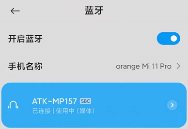<br />
图4.15.3 4 手机端已连接上开发板蓝牙
</center>

&emsp;&emsp;更多linux下蓝牙指令参考如下<br />
&emsp;&emsp; -	l2ping可像ping指令一样，检查能目标蓝牙是否在线，并有数据回复。<br />
&emsp;&emsp; -	sdptool browse查看目标蓝牙的可用服务

```c#
l2ping XX:XX:XX:XX:XX:XX              //XX:XX:XX:XX:XX:XX为目标蓝牙地址
sdptool browse XX:XX:XX:XX:XX:XX      //XX:XX:XX:XX:XX:XX为目标蓝牙地址
…
```


