# 4.16 4G模块ME3630-W测试


<div class="stm32mp157_center-table-div">
<table class="stm32mp157_center-table">
  <tr>
    <th>STM32MP157</th>
    <th>MINI STM32MP157</th>
  </tr>
  <tr>
    <td>支持</td>
    <td>不支持</td>
  </tr>
</table>
</div>


&emsp;&emsp;正点原子ATK-STM32MP157底板上预留4G模块接口，ME3630-W，EC20等4G模块的安装。准备ME3630-W 4G模块，正点原子店铺有售卖。将ME3630-W 4G模块插到4G模块接口处，拧上螺丝。保证4G模块与座子接口吻合连接。请使用原装天线，把天线连接到4G模块的MAIN接口处。（温馨提示：4G模块在开封使用后，金手指容易氧化，时间长了上面会有一层氧化膜，如果多次实验不成功，请检查4G模块是否插好，或者是否有氧化膜。使用后请保存好4G模块！）

&emsp;&emsp;正确插入4G卡（支持移动、联通、电信4G卡）及插好模块，开发板启动后底板上的WWAN LED 会亮绿灯。如果WWAN LED绿灯未亮起，请检查模块是否正确连接插入，4G卡是否插入，天线是否接好，开发板是必须插上配带的12V电源，不能只用串口USB_TTL供电。

<center>
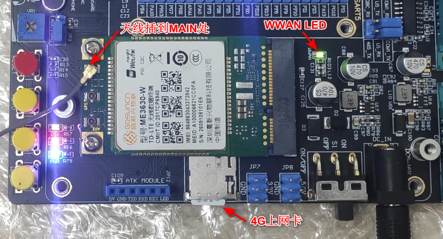<br />
图4.16.4 1 4G模块天线SIM卡连接图
</center>

&emsp;&emsp;4G模块正常加载后，可以在/dev/下看到有3个ttyUSB*生成。4G模块通AT指令访问/dev/ttyUSB2进行通信。

```c#
ls /dev/ttyUSB*
```

<center>
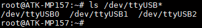<br />
图4.16.4 2 查看生成的/dev/ttyUSB*节点
</center>

&emsp;&emsp;使用lsusb指令可以看到模块的相关信息。

```c#
lsusb
```

<center>
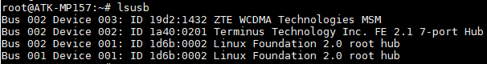<br />
图4.16.4 3 查看模块的相关信息
</center>

## 4.16.1 pppd拨号上网

&emsp;&emsp;出厂文件系统/home/root/shell/4G目录下已经存放有测试4G模块相关脚本，脚本具体内容介绍可参考正点原子】STM32MP1嵌入式Linux驱动开发指南V1.xpdf Linux 4G通信实验。

&emsp;&emsp;新建一个目录，用于下面的脚本运行时生成DNS客户机配置文件。

```c#
mkdir /etc/ppp/		#如果已经存在，则不用重复创建
```

&emsp;&emsp;进入/home/root/shell/4G/目录下。

```c#
cd /home/root/shell/4G/
```

&emsp;&emsp;使用ls指令可以看到此路径下有多个脚本文件，如果没有这样的文件，请及时更新系统固件。

<center>
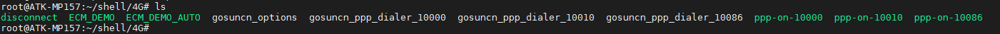<br />
图4.16.1 1 查看脚本
</center>

&emsp;&emsp;其中尾缀10000表示适用于电信卡，10010表示适用于联通卡，10086表示适用于移动卡。

&emsp;&emsp;这里笔者以电信卡为例。执行下面ppp-on脚本，&的作用是后台运行

```c#
./ppp-on-10000 &
```

<center>
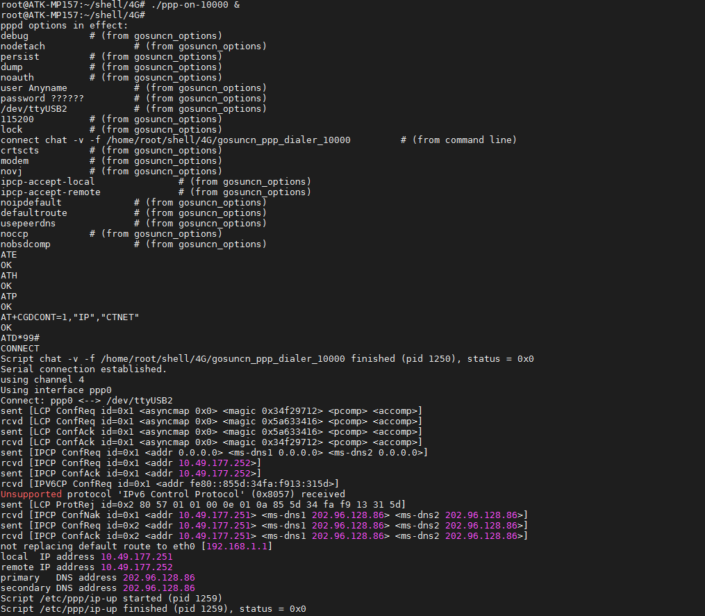<br />
图4.16.1 2 ppp拨号上网获取到ip
</center>

&emsp;&emsp;使用ifconfig可查看4G模块的网络名称。

<center>
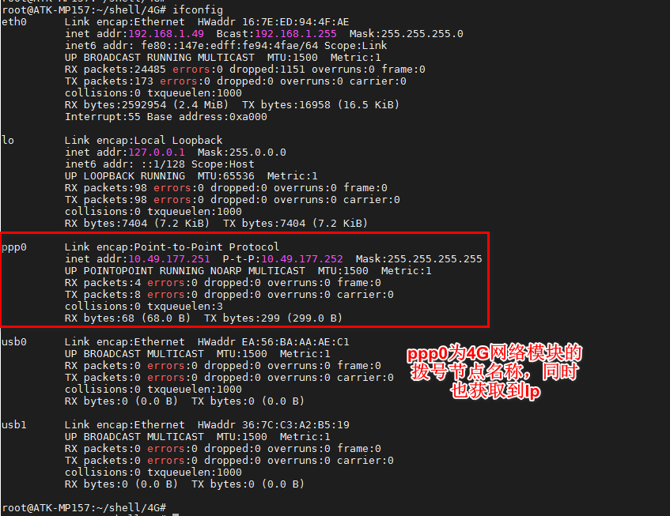<br />
图4.16.1 3 查看4G网络节点名称
</center>

&emsp;&emsp;ping百度测试连通性，-I是指定网卡。看到如下结果，有数据回复表示连通。按“Ctrl +c”终止指令。

<center>
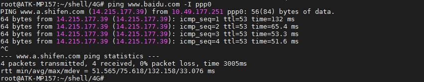<br />
图4.16.1 4 ping百度测试连网络连接
</center>

## 4.16.2 ECM上网

&emsp;&emsp;在操作系统看来，CDC ECM设备就是一个虚拟以太网卡，包含标准网卡需要的MAC地址和IP地址。

&emsp;&emsp;ECM_DEMO_AUTO 和 ECM_DEMO是高新兴ECM上网的程序（我们不需要知道源码，因为它只是一个工具），指令简介如下：

```c#
ECM_DEMO -t up                           //开启ecm上网 
ECM_DEMO -t down                         //关闭ecm上网
ECM_DEMO -t up -p /dev/ttyUSB1 -a 3gnet  //开启的同时指定对应的apn和拨号端口
ECM_DEMO -t down -p /dev/ttyUSB1         //关闭ecm上网
```

&emsp;&emsp;详细的参数可以查看源代码或者执行 ECM_DEMO -h  查看ECM_DEMO_AUTO 和 ECM_DEMO参数是一样的，区别是ECM_DEMO执行完流程就会退出，ECM_DEMO_AUTO会一直运行并每隔一段时间会检查是否断网，断网了会自动重连
ECM_DEMO_AUTO默认会自动执行拨号流程，故适合做开机自启的程序。

&emsp;&emsp;要配置ECM模式上网，如果运行了pppd上网，请先执行disconnect脚本断开pppd拨号上网，再执行下面的指令配置成ECM模式链接网络。

```c#
./disconnect
./ECM_DEMO -t up
```
<center>
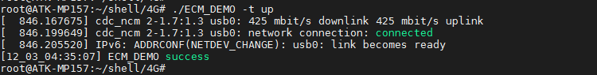<br />
图4.16.2 1断开ppp-on上网，执行ecm-on上网
</center>

&emsp;&emsp;使用ifconfig指令查看获取的ip地址，如果没有获取到ip地址使用udhcpc -i usb0获取。

```c#
ifconfig
```

&emsp;&emsp;下图usb0会自动分配了一个192.168.7.1 IP，这个IP是系统自动分配usb网络的静态IP，，我们需要使用udhcpc来手动获取。

```c#
udhcpc -i usb0		// 注意：有可能为usb1，这与otg usb驱动和4G驱动加载顺序有关。
```

<center>
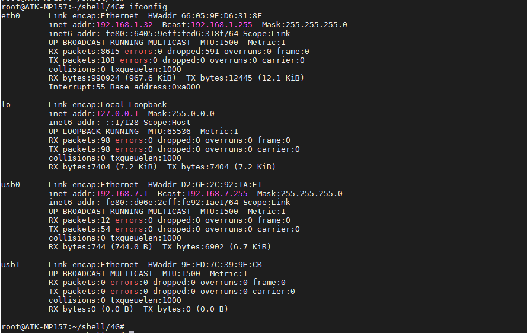<br />
图4.16.2 2 查看ip地址
</center>

<center>
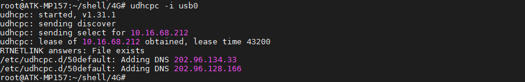<br />
图4.16.2 3 获取的ip地址
</center>

&emsp;&emsp;通过ping www.baidu.com来测试是否能上网。-I参数是指定usb0(4G网络)，按“Ctrl +c”结束。

```c#
ping www.baidu.com -I usb0		// “-I”参数是指定网卡名
```

<center>
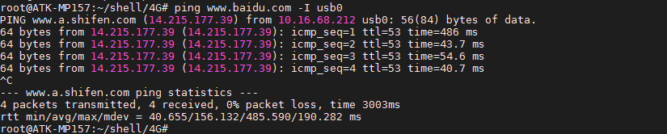<br />
图4.16.2 4 ping 百度测试上网
</center>


&emsp;&emsp;如果并检测是否在线（断线重连），建议使用ECM_DEMO_AUTO这个指令，放于后台运行。连上后，如果没有获取到ip地址使用udhcpc -i usb0获取。

<center>
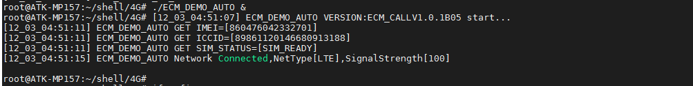<br />
图4.16.2 5 ECM_DEMO_AUTO联网
</center>


