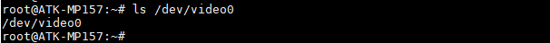
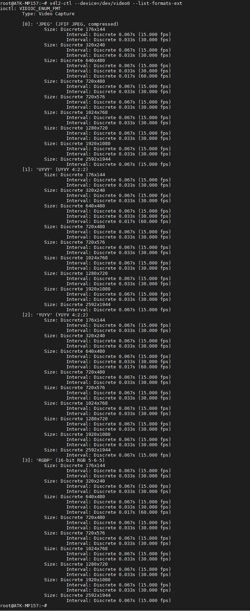
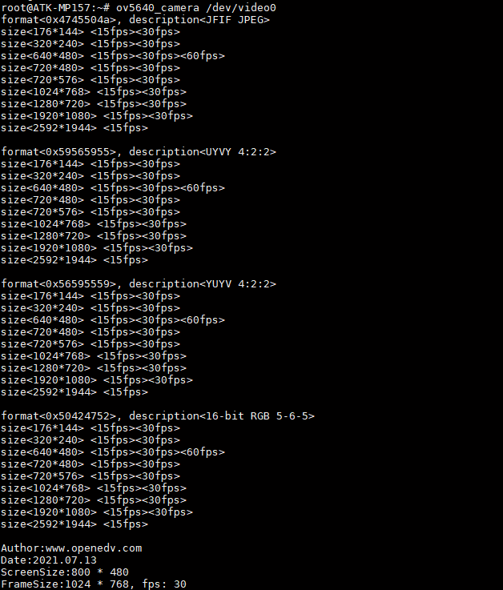
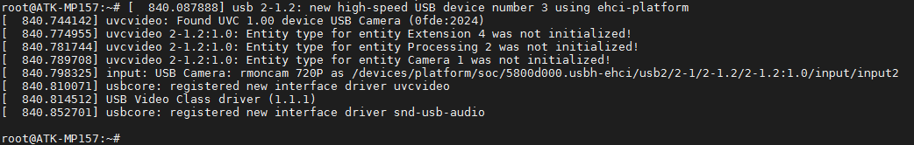
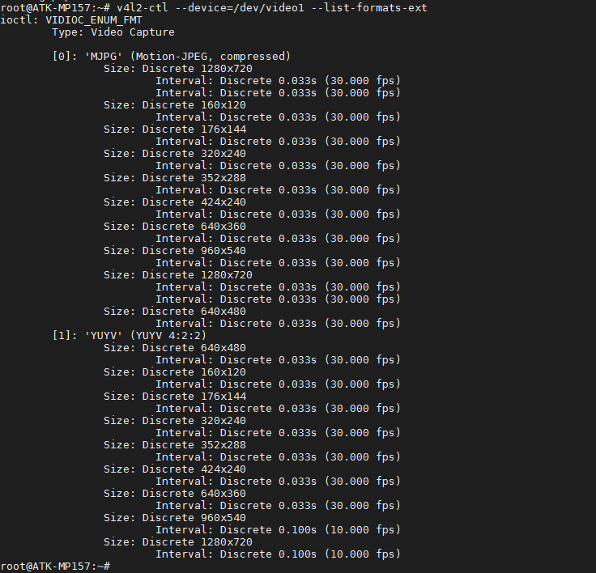

# 4.18 OV5640摄像头/USB摄像头测试

&emsp;&emsp; - OV5640摄像头测试

&emsp;&emsp;实验前请准备ov5640摄像头模块（500万像素），本公司的任何分辨率的RCB LCD电容屏。

&emsp;&emsp;摄像头插法：<br />
&emsp;&emsp;摄像头镜头往开发板外则直接插到CAMERA接口处。由于没有防反插设计，插摄像头时需要注意看底板丝印，按引脚编号对应插上，即镜头朝向板子外侧。
&emsp;&emsp;开机前先插上摄像头，不支持热插拨。插上摄像头再启动开发板。


<center>
<br />
图4.18 1 启动时5640驱动打印的信息
</center>

&emsp;&emsp;查看ov5640生成的节点，确认节点是video0。

```c#
ls /dev/video0
```

<center>
<br />
图4.18 2 ov5640节点
</center>

&emsp;&emsp;查看驱动中支持摄像头的格式，主要查看支持的分辨率采集及支持的采集帧数。

```c#
v4l2-ctl --device=/dev/video0 --list-formats-ext
```

<center>
<br />
图4.18 3 ov5640支持的采集分辨率及格式
</center>

&emsp;&emsp;执行下面指令，测试OV5640摄像头。ov5640_camera是正点原子编写的测试OV5640摄像头的应用程序，“/dev/video0”是OV5640摄像头的节点。

```c#
ov5640_camera /dev/video0
```

<center>
<br />
图4.18 4 运行ov5640_camera摄像头程序程序采集
</center>

&emsp;&emsp;或者使用系统自带的gstreamer指令测试。

&emsp;&emsp;采集视频到LCD上显示。

```c#
gst-launch-1.0 -v v4l2src device=/dev/video0 ! "video/x-raw, format=(string)YUY2, \
 width=(int)640, height=(int)480, framerate=(fraction)30/1" ! videoconvert ! fbdevsink
 ```

&emsp;&emsp;指令中的640为采集分辨率的宽，480为采集分辨率的高，30为帧率。需要严格按照支持的格式填写。

&emsp;&emsp;录制视频。

```c#
gst-launch-1.0 -v v4l2src device=/dev/video0 ! "video/x-raw, format=(string)YUY2, \ 
width=(int)640,height=(int)480, framerate=(fraction)30/1" ! videoconvert ! avimux \
! filesink location=test.avi
```

&emsp;&emsp;播放录制的视频。

```c#
gst-launch-1.0 filesrc location=test.avi ! decodebin !  videoconvert ! fbdevsink
```

&emsp;&emsp;拍照。

```c#
gst-launch-1.0 v4l2src num-buffers=1 device=/dev/video0 ! jpegenc ! filesink location=test.jpg
```

&emsp;&emsp;显示拍到的照片。

```c#
gst-launch-1.0 filesrc location=test.jpg  ! decodebin !  videoconvert ! fbdevsink
```

&emsp;&emsp; - USB摄像头测试

&emsp;&emsp;同理，实验前请准备USB摄像头，符合UVC（USB video device class）协议的摄像头均可。UVC，全称为：USB video class 或USB video device class，是Microsoft与另外几家设备厂商联合推出的为USB视频捕获设备定义的协议标准。符合UVC规格的硬件设备在不需要安装其他驱动程序下即可在主机中正常使用。

&emsp;&emsp;插上USB摄像头，支持热插拨，串口打印的信息如下。

<center>
<br />
图4.18 5 USB摄像头打印的信息
</center>

&emsp;&emsp;由于上面测试ov5640是/dev/video0，那么/dev/video1就是USB摄像头的节点。

<center>
<br />
图4.18 6 查看USB摄像头的节点
</center>

&emsp;&emsp;查看USB摄像头的支持格式。

```c#
v4l2-ctl --device=/dev/video1 --list-formats-ext
```

<center>
<br />
图4.18 7 USB摄像头支持的分辨率与格式
</center>

&emsp;&emsp;测试方法，可以直接使用系统自带的gstreamer指令测试。请参考上面OV5640的gstreamer测试方法。只需要把“video0”改为“video1”即可！


