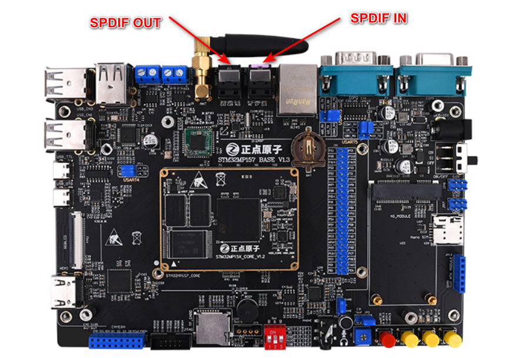

# 4.19 SPDIF测试

<table class="stm32mp157_center-table">
  <tr>
    <th>STM32MP157</th>
    <th>MINI STM32MP157</th>
  </tr>
  <tr>
    <td>支持</td>
    <td>不支持</td>
  </tr>
</table>

&emsp;&emsp;SPDIF简介：

&emsp;&emsp;SPDIF（Sony/Philips Digital Interface ）是SONY、PHILIPS数字音频接口的简称。就传输方式而言，SPDIF分为输出（SPDIF OUT）和输入（SPDIF IN）两种。

&emsp;&emsp;如下图，ATK-STM32MP157底板上两个SPDIF接口，一个为SPDIF OUT接口，另一个为SPDIF IN接口。

 
图4.19 1 SPDIF位置示意图

&emsp;&emsp;测试需要使用到spdif数据光纤，测试方法略。

