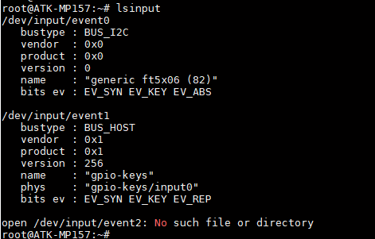
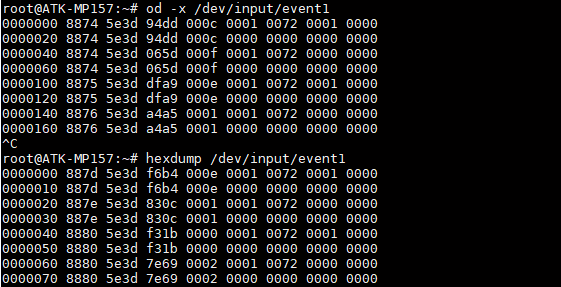

# 4.2 按键测试

&emsp;&emsp;正点原子STM32MP157开发板上有配备两个用户按键。它们在底板原理图对应的关系如下。

<div class="stm32mp157_center-table-div">
<table class="stm32mp157_center-table">
  <tr>
    <th>管脚名称</th>
    <th>PG3</th>
    <th>PH7</th>
  </tr>
  <tr>
    <td>正点原子STM32MP157</td>
    <td>KEY0</td>
    <td>KEY1</td>
  </tr>
</table>
</div>


&emsp;&emsp;我们可以在内核源码里配置设备是否启用按键。内核源码路径为arch/arm/boot/dts/stm32mp157d-atk.dtsi。

```c#
 gpio-keys {
            compatible = "gpio-keys";
            autorepeat;
            key0 {
                label = "USER-KEY0";
                linux,code = <114>;
                gpios = <&gpiog 3 GPIO_ACTIVE_LOW>;
                gpio-key,wakeup;
            };

            key1 {
                label = "USER-KEY1";
                linux,code = <115>;
                gpios = <&gpioh 7 GPIO_ACTIVE_LOW>;
                gpio-key,wakeup;
            };
    };
```

&emsp;&emsp;测试：<br />
&emsp;&emsp;在文件系统输入下面指令查看输入事件对应的设备

```c#
lsinput
```

<center>
<br />
图4.2 1 按键事件
</center>

&emsp;&emsp;在上图我们可以知道event1为按键的输入事件，通过上面我们还发现event0为触摸屏（ft5x06触摸芯片）的事件，所以event1不一定是按键的事件，这与用户板子上的设备有关！所以我们要使用lsinput来查看输入事件。

&emsp;&emsp;我们使用od -x 或者hexdump指令来查看按键的输入信息。按下KEY0或者KEY1有如下信息出现，说明按键正常。按Ctrl+c终止指令。

```c#
od -x /dev/input/event1
hexdump /dev/input/event1
```

<center>
<br />
图4.2 2 打印的按键事件
</center>


