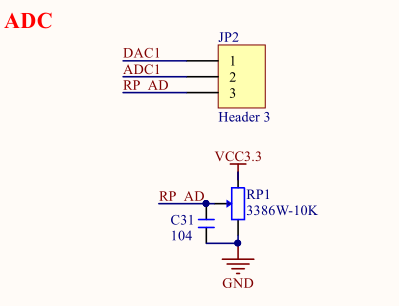
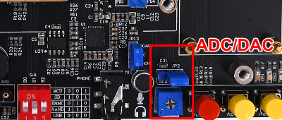
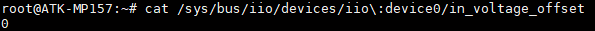
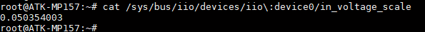

# 4.20 ADC测试

&emsp;&emsp;注意：ADC的采集电压绝对值最大是3.3V，请不要超过 3.3V，否则可能对芯片造成损坏。ATK-STM32MP157底板上JP2处有一路ADC与一路DAC方便用户测试。底板原理图如下。


<center>
<br />
图4.20 1 ADC/DAC底板原理图
</center>

&emsp;&emsp;ADC/DAC接口开发板位置如下，下图为STM32MP157开发板的ADC/DAC位置，Mini底板ADC/DAC的位置不一样。

<center>
<br />
图4.20 2 开发板ADC/DAC位置
</center>

&emsp;&emsp;从上面的原理图可知，DAC1输出可通过跳线帽给ADC1作输入，或者通过RP_AD（微调电阻）给ADC1作输入。
ADC的主要特性：

&emsp;&emsp; - STM32MP157D支持ADC功能，提供两个ADC控制器，采样精度可配置为16, 14, 12, 10和8。

&emsp;&emsp;在Linux系统中，ADC采样属于IIO子系统下，可以通过SYSFS提供的接口来访问ADC控制器，使用的是16位精度。

&emsp;&emsp;使用下面的指令来获取ADC1采样的数据，这里读出里出来的值是原始值raw_value。

```c#
cat /sys/bus/iio/devices/iio\:device0/in_voltage19_raw
```

&emsp;&emsp;需要使用下面的计算公式来转换成实际值

```c#
real_value = (raw_value + offset_value) * scale
```

&emsp;&emsp;其中offset的值可以通过下面的指令获取

```c#
cat /sys/bus/iio/devices/iio\:device0/in_voltage_offset
```

<center>
<br />
图4.20 3 查看offset的值
</center>

&emsp;&emsp;其中scale的值可以通过下面的指令获取，此值跟参考电压有关。

```c#
cat /sys/bus/iio/devices/iio\:device0/in_voltage_scale
```

<center>
<br />
图4.20 4 查看scale值
</center>


