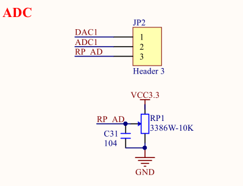
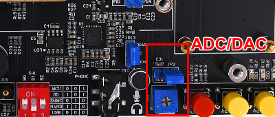
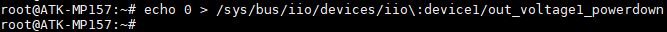
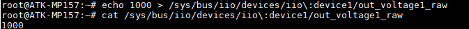

# 4.21 DAC测试

&emsp;&emsp;ATK-STM32MP157D底板上JP2处有一路ADC与一路DAC方便用户测试。底板原理图如下。

<center>
<br />
图4.21 1 ADC/DAC底板原理图
</center>

&emsp;&emsp;ADC/DAC开发板位置如下。

<center>
<br />
图4.21 2开发板ADC/DAC位置
</center>


&emsp;&emsp;从上面的原理图可知，DAC1输出可通过跳线帽给ADC1作输入，或者通过RP_AD（微调电阻）给ADC1作输入。

&emsp;&emsp;DAC的特性如下：<br />
&emsp;&emsp; -	它可以配置为8位或12位模式(数据可以左对齐或右对齐)<br />
&emsp;&emsp; -	它有两个输出通道，每个通道都有自己的转换器<br />
&emsp;&emsp; -	双DAC通道模式可以独立或同时进行<br />
&emsp;&emsp; -	它有内置的噪声和三角形波形发生器，并支持转换的触发器，使用:TIM，LPTIM或EXTI<br />
&emsp;&emsp; -	DAC输出缓冲器允许高驱动器输出电流<br />
&emsp;&emsp; -	它可以在正常模式或低功耗采样和保持模式下工作(使用LSI时钟，来自RCC)<br />
&emsp;&emsp; -	可以与DMA控制器结合使用（带欠载错误检测）<br />
&emsp;&emsp; -	通用基准电压可由连接到VREF +引脚的VREFBUF或任何其他外部regulator提供。

&emsp;&emsp;在Linux系统中，DAC属于IIO子系统下，可以通过SYSFS提供的接口来控制DAC控制器，使用的是12位精度。

&emsp;&emsp;开启DAC输出

```c#
echo 0 > /sys/bus/iio/devices/iio\:device1/out_voltage1_powerdown
```

<center>
<br />
图4.21 3 开启DAC输出
</center>

&emsp;&emsp;同理与ADC一样，需要使用下面的计算公式来转换成实际值

```c#
real_value = raw_value * scale
```

&emsp;&emsp;其中scale的值可以通过下面的指令获取，此值跟参考电压有关。

```c#
cat /sys/bus/iio/devices/iio\:device1/out_voltage1_scale
```

&emsp;&emsp;设置DAC输出的电压值，因为DAC是12位精度，也就是说，最大值只能设置2的12次方减1，即最大值是4095。参考电压为3.3V。

```c#
echo 1000 > /sys/bus/iio/devices/iio\:device1/out_voltage1_raw
```

&emsp;&emsp;再查看DAC输出的数值。

```c#
cat /sys/bus/iio/devices/iio\:device1/out_voltage1_raw
```

<center>
<br />
图4.21 4 查看DAC输出的数值
</center>


&emsp;&emsp;可以通过下面的式子算出DAC的输出电压值。其中out_raw为上面DAC输出的数值。3.3V是 输出参考电压。

```c#
Vout = 3.3 *(out_raw / (2^12 - 1))
```

&emsp;&emsp;我们可以将跳线帽接到ADC1处，让DAC1输出给ADC1采集 。在4.20小节中读取出ADC1的采集电压，也是可以测出DAC1的电压值。


