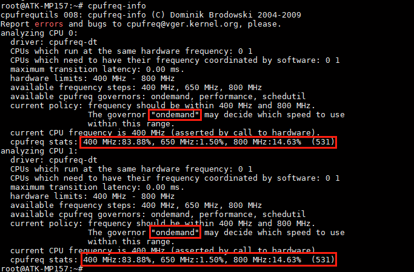

# 4.23 CPU主频

## 3.23.1 5G模块上网测试


&emsp;&emsp;使用cpufreq-info指令查看CPU主频

```c#
cpufreq-info
```

<center>
<br />
图4.23 1查看CPU主频
</center>

&emsp;&emsp;通过以上结果可知，CPU0和CPU1工作在400MHZ到800MHZ之间，调频模式为“ondemand”，根据此模式定期检查负载，根据负载来调节频率。