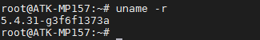
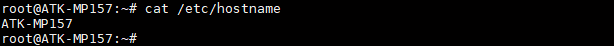
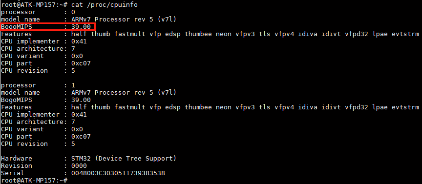
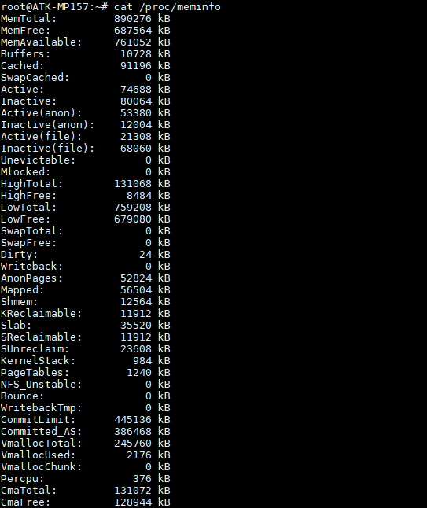
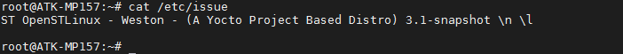

# 4.24 查看系统信息

## 4.24.1 查看系统内核版本号

&emsp;&emsp;正点原子STM32MP157出厂内核使用git管理，所以出货时会自带一个内核版本号。

```c#
uname -r
```

<center>
<br />
图4.24.1 1 查看系统内核版本号
</center>

## 4.24.2 查看系统主机名

&emsp;&emsp;查看系统主机名，可修改/etc/hostname来定制个人的主机名。

```c#
cat /etc/hostname
```

<center>
<br />
图4.24.2 1 查看系统主机名
</center>

## 4.24.3 查看CPU相关信息

```c#
cat /proc/cpuinfo
```

<center>
<br />
图4.24.3 1 查看CPU相关信息
</center>

&emsp;&emsp;如上比如BogoMIPS这个值，是根据CPU运行速度的指标，是Linux操作系统中衡量计算机处理器运行速度的的一种尺度，是由Linux主要开发者linus Torvalds通过calibrate_delay（）函数计算出来的，但是只能用来粗略计算处理器的性能，并不十分精确。影响这个值的大小因素是CPU当前运行的主频。如上39.00是cpu运行在400MHZ时所计算出来的数值。

## 4.24.4 查看内存相关信息

```c#
cat /proc/meminfo
```

<center>
<br />
图4.24.4 1 查看内存相关信息
</center>

## 4.24.5 查看系统登录欢迎信息

```c#
cat /etc/issue
```

&emsp;&emsp;可以编辑这个issue文件来定制开机欢迎信息。

<center>
<br />
图4.24.5 1 查看系统登录欢迎信息
</center>

