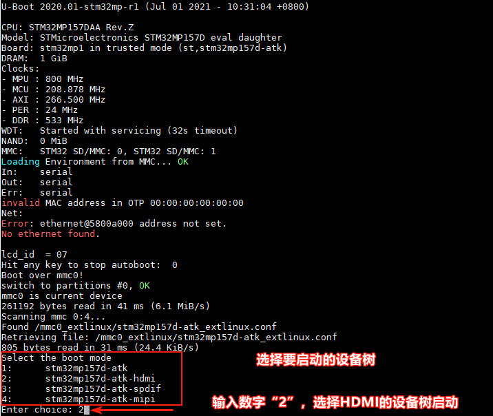
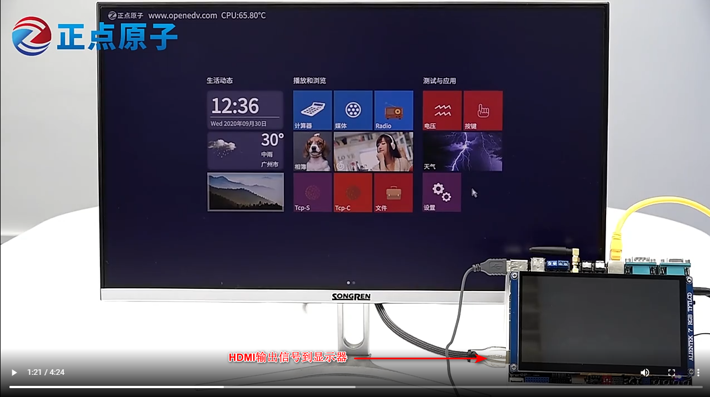
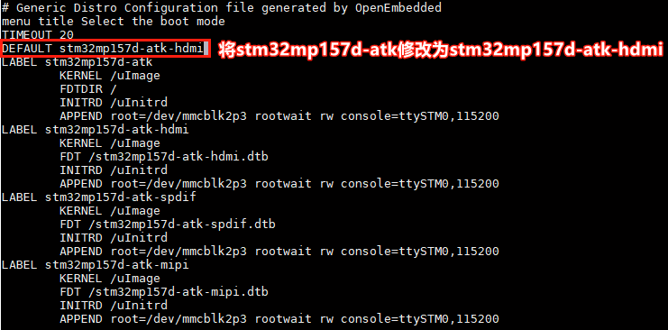

# 4.25 HDMI测试

&emsp;&emsp; -	板载HDMI最大支持分辨率简介

&emsp;&emsp;因为STMP32MP157 CPU没有HDMI控制器，所以只能用RGB转HDMI。ATK-STMMP157板载HDMI Sil902x芯片（充当一个HDMI发送器），Sil902x芯片支持1080p输出。但是STMMP157  CPU 最大只能输出给LTDC 信号最大为WXGA (1366×768) @60 fps。所以板载的HDMI只能由CPU的LTDC信号决定，也就是最大只能输出WXGA (1366×768) @60 fps。

&emsp;&emsp;出厂系统默认配置的HDMI输出分辨率大小为1280×720 @60 fps。无需修改成WXGA (1366×768) @60 fps，因为有些显示器可能不支持这个分辨率，可能会显示不了。经过实测，出厂系统使用Qt越大分辨率会不流畅，因为Qt界面分辨率大的比较耗性能。所以如果有正点原子RGB LCD屏在滑动界面时会感觉比较流畅，因为RGB LCD屏分辨率较小，要知道STM32MP157也只不过是两个A7而已，性能不能与手机相比。

&emsp;&emsp;由于HDMI信号是由RGB信号转过来的，所以HDMI与RGB LCD共用一个接口。所以理论上只能使用其中一种。

&emsp;&emsp;开发板首先用HDMI连接线（用户手上需要有HDMI连接线，没有就需要用户自行购买），连接到开发板上的HDMI接口，另一端连接到显示器，显示器上电。开发板拨码从eMMC启动，在串口终端里看到Uboot启动倒计时结束后，按下数字键“2”来选择使用HDMI的设备树，按Enter后就会加载HDMI设备树启动。


<center>
<br />
图4.25 1 HDMI设备树选择
</center>

&emsp;&emsp;启动成功后，可以在显示屏显示出厂系统的Qt UI。如下图。

<center>
<br />
图4.25 2 HDMI显示屏显示的效果
</center>

&emsp;&emsp;永久修改加载HDMI设备树启动

&emsp;&emsp;出厂系统默认以LCD的设备树启动，默认以stm32mp157d-atk.dtb这个设备树启动。从eMMC启动后，可以在出厂文件系统的挂载文件目录下的/run/media/mmcblk2p2/mmc1_extlinux/stm32mp157d-atk_extlinux.conf这个文件里修改默认启动的设备树。若用户是使用TF（SD）系统卡启动启动系统，应在出厂文件系统的挂载文件目录下的/run/media/mmcblk1p2/mmc0_extlinux/stm32mp157d-atk_extlinux.conf这个文件修改。

&emsp;&emsp;在串口终端输入以指令，编辑启动配置文件，将stm32mp157d-atk修改为stm32mp15d-atk-hdmi。按Esc再按:wq保存退出。这样以后开发板启动就会默认以HDMI设备树启动。用户不用在Uboot选择设备树启动了。

```c#
vi /run/media/mmcblk2p2/mmc1_extlinux/stm32mp157d-atk_extlinux.conf
```

<center>
<br />
图4.25 3 修改默认加载HDMI设备树
</center>

&emsp;&emsp;关于stm32mp157d-atk_extlinux.conf文件语法的说明，在我们STM32MP1嵌入式Linux驱动开发指南里有详细的说明。


