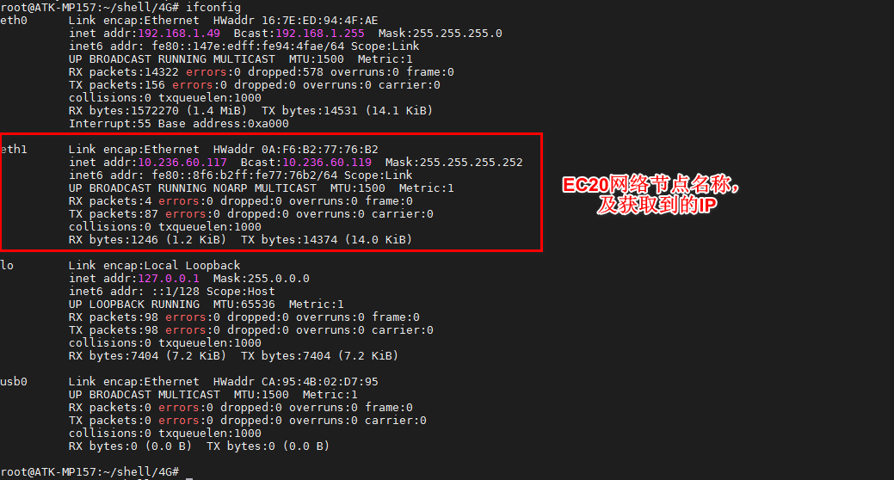

# 4.29 4G模块EC20测试

<div class="stm32mp157_center-table-div">
<table class="stm32mp157_center-table">
  <tr>
    <th>STM32MP157</th>
    <th>MINI STM32MP157</th>
  </tr>
  <tr>
    <td>支持</td>
    <td>可用USB转PICE转接板接USB接口</td>
  </tr>
</table>
</div>


&emsp;&emsp;实验前准备：<br />
&emsp;&emsp;1. EC20 4G模块
&emsp;&emsp;2. 4G上网卡
&emsp;&emsp;3. 天线（用于放大信号）

&emsp;&emsp;正点原子ATK-STM32MP157底板上预留4G模块接口，ME3630-W，EC20等4G模块的安装。准备EC20模块，请自行在网上购买，**注意购买时需要买天线，单单模块是不能正常工作的！**（备注：EC20有许多类型模块，目前测试过的是EC20-CE模块，其中EC20-CE系列又有多种模块，不同的模块功能不一样，比如支持的运营商不一样，详细请咨询卖家），其他EC20系列请自行测试，理论上驱动一样，有需求找移远技术支持。）。将EC20 4G模块插到4G模块接口处，拧上螺丝。保证4G模块与座子接口吻合连接。请使用原装天线，把天线连接到4G模块的MAIN接口处。

&emsp;&emsp;正确插入4G卡（支持的运营商，请咨询对应模块的卖家，**注意有些可能模块不支持物联网卡，请使用普通4G卡测试**）及插好模块，开发板启动后底板上的WWAN LED 会亮绿灯。如果WWAN LED绿灯未亮起，请检查模块是否正确连接插入，4G卡是否插入，天线是否接好，**开发板是必须插上配带的12V电源**，不能只用串口USB_TTL供电。模块安装如下图所示：

<center>
<br />
图4.29 1 EC20连接示意图
</center>

&emsp;&emsp;WWAN LED指示灯说明，当为低的时候LED灯点亮，参考电路如下：

<center>
<br />
图4.29 2 WWWAN LED 指示灯
</center>

&emsp;&emsp;默认状态下LED_WWAN对应的LED灯闪烁情况：

<div class="stm32mp157_center-table-div">
<table class="stm32mp157_center-table">
  <tr>
    <th>引脚工作状态</th>
    <th>所指示的网络状态</th>
  </tr>
  <tr>
    <td>慢闪(200ms高/1800ms低)</td>
    <td>找网状态</td>
  </tr>
  <tr>
    <td>慢闪(1800ms高/200ms低)</td>
    <td>待机状态</td>
  </tr>
  <tr>
    <td>快闪(125ms高/125ms低)</td>
    <td>数据传输模式</td>
  </tr>
  <tr>
    <td>高电平</td>
    <td>通话中</td>
  </tr>
</table>
</div>

&emsp;&emsp;4G模块正常加载后，可以在/dev/下看到有4个ttyUSB*生成。4G模块通AT指令访问/dev/ttyUSB2进行通信。

<center>
<br />
图4.29 3 查看4G模块的接口
</center>


&emsp;&emsp;使用lsusb指令可以看到模块的相关信息。

```c#
lsusb
```

<center>
<br />
图4.29 4 查看4G模块的信息
</center>

&emsp;&emsp;这四路ttyUSB的功能如下图图4.29 5所示，不全部测试这些功能了，这里我们只测试上网功能。详细请自行参考EC20 4G模块手册。

<center>
<br />
图4.29 5 四路ttyUSB的功能示意图
</center>


## 4.29.1 ppp拨号上网

&emsp;&emsp;出厂文件系统/home/root/shell/4G目录下已经存放有测试4G模块相关脚本，脚本具体内容介绍可参考【正点原子】STM32MP1嵌入式Linux驱动开发指南V1.8以上版本 Linux 4G通信实验。

&emsp;&emsp;新建一个目录，用于下面的脚本运行时生成DNS客户机配置文件。


```c#
mkdir /etc/ppp/		#如果已经存在，则不用重复创建
```

&emsp;&emsp;进入/home/root/shell/4G/目录下。

```c#
cd /home/root/shell/4G/
```

&emsp;&emsp;使用ls指令可以看到此路径下有多个脚本文件，如果没有这样的文件，请及时更新系统固件。

<center>
<br />
图4.29.1 1 查看脚本
</center>

&emsp;&emsp;其中尾缀10000表示适用于电信卡，10010表示适用于联通卡，10086表示适用于移动卡。

&emsp;&emsp;这里笔者以移动卡为例。执行下面ppp-on-10086脚本，&的作用是后台运行。

```c#
./ppp-on-10086 &
```

<center>
<br />
图4.29.1 2 ppp拨号上网成功
</center>

&emsp;&emsp;使用ifconfig可查看4G模块的网络名称。

<center>
<br />
图4.29.1 3 获取到的IP
</center>

&emsp;&emsp;ping百度测试连通性，-I是指定网卡。看到如下结果，有数据回复表示连通。按“Ctrl +c”终止指令。

```c#
ping www.baidu.com -I ppp0
```

<center>
<br />
图4.29.1 4 连网测试
</center>

## 4.29.2 使用quectel-CM

&emsp;&emsp;使用 quectel-CM 拨号程序工具（这个工具是我们预先交叉编译好放进文件系统/usr/sbin 目录下面的），方便用户使用。【正点原子】STM32MP1嵌入式Linux驱动开发指南V1.8以上版本也有讲到这个工具。

&emsp;&emsp;如果已经做了上一步的ppp拨号上网，请执行脚本断开。

```c#
./disconnect
```

<center>
<br />
图4.29.2 1 断开ppp链接
</center>

&emsp;&emsp;输入quectel-CM -h查看用法。

```c#
quectel-CM -h
```

<center>
<br />
图4.29.2 2 查看quectel-CM工具说明
</center>

&emsp;&emsp;可以看到-s参数是指定apn类型，移动卡apn一般是cmnet，联通卡apn一般是3gnet，电信卡一般是ctnet。备注：APN指一种网络接入技术，通常是通过手机上网时必须配置的一个参数，它决定了手机通过哪种接入方式来访问网络。

```c#
quectel-CM &			// 如果不清楚，直接输入quectel-CM，&的作用是后台运行。
```

<center>
<br />
图4.29.2 3 通过quectel-CM工具上网
</center>


&emsp;&emsp;输入ifconfig命令，查看EC20 4G模块的网络节点名称。eth0是板子的网口网络节点名称，那么eth1就是EC20 4G模块的网络节点名称了。

<center>
<br />
图4.29.2 4 获取到的IP
</center>

&emsp;&emsp;ping百度测试连通性，-I是指定网卡。看到如下结果，有数据回复表示连通。按“Ctrl +c”终止指令。

<center>
<br />
图4.29.2 5 ping百度测试
</center>

## 4.29.3 GPS测试

&emsp;&emsp;EC20还有一个GPS的功能，通过AT指令去设置开启GPS，本小节只教如何开启和查看原始的GPS数据。

&emsp;&emsp;**注意事项：图4.29 2中有个GPS天线接口，可以购买带有GPS天线版本的EC20。接法和4G天线一样。**

&emsp;&emsp;4G模块正常初始化如下打印信息:

<center>
<br />
图4.29.3 1 4G模块初始化
</center>

&emsp;&emsp;上图可以查看出来已经初始化4个串口接口了，运行以下指令进行使用GPS功能。（注意：需要到空旷地带测试，在房间测试信号接收可能会受影响）

```c#
echo -e "AT+QGPS=1\r\n" >/dev/ttyUSB2 //通过echo命令把AT+QGPS=1数据发送到USB2
```

<center>
<br />
图4.29.3 2 开启GPS功能
</center>

&emsp;&emsp;运行以下代码进行查看GPS的原始数据。可按“Ctrl + c”终止cat指令。

```c#
cat /dev/ttyUSB1
```

<center>
<br />
图4.29.3 3 GPS原始数据
</center>

&emsp;&emsp;关闭GPS功能可以运行以下代码：可按“Ctrl + c”终止cat指令。

```c#
echo -e "AT+QGPSEND\r\n" >/dev/ttyUSB2
cat /dev/ttyUSB1
```

&emsp;&emsp;这个时候我们可以看到ttyUSB1串口不再打印GPS的原始数据了。


