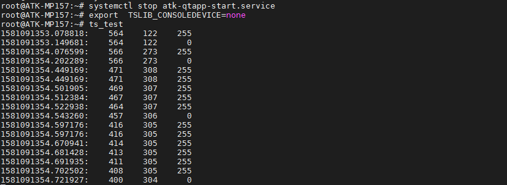
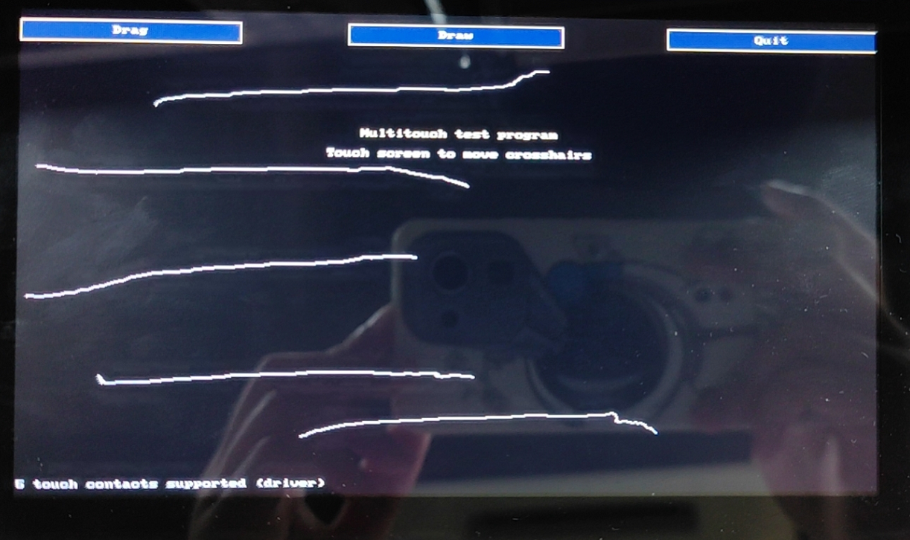

# 4.3 LCD测试

&emsp;&emsp;在出厂系统里，因为正点原子的屏幕rgb数据线上的最高位有ID，所以出厂系统会识别屏的分辨率。才加载相应的触摸驱动。正点原子所使用的RGB屏幕有5种，如下表：

<div class="stm32mp157_center-table-div">
<table class="stm32mp157_center-table">
  <tr>
    <th>屏幕尺寸</th>
    <th>触摸芯片</th>
    <th>屏幕ID</th>
  </tr>
  <tr>
    <td>4.3寸屏（480x272）</td>
    <td>gt9xx</td>
    <td>0x00</td>
  </tr>
  <tr>
    <td>4.3寸屏（800x480）</td>
    <td>gt9xx/gt1151</td>
    <td>0x04</td>
  </tr>
  <tr>
    <td>7寸屏（800x480）</td>
    <td>ft5x06/cst340(cst340用的是ft5x06的固件)</td>
    <td>0x01</td>
  </tr>
  <tr>
    <td>7寸屏（1024x600）</td>
    <td>ft5x06/cst340(cst340用的是ft5x06的固件)</td>
    <td>0x02</td>
  </tr>
  <tr>
    <td>10寸屏（1280x800）</td>
    <td>gt9xx</td>
    <td>0x03</td>
  </tr>
</table>
</div>

## 4.3.1触摸测试

&emsp;&emsp;内核源码触摸驱动路径为drivers/input/touchscreen/。设备树文件arch/arm/boot/dts/stm32mp157d-atk.dts配置如下：

```c#
&i2c2 {
    ft5x06: ft5x06@38 {
        compatible = "edt,edt-ft5206";
        reg = <0x38>;
        interrupts = <1 IRQ_TYPE_EDGE_FALLING>;
        interrupt-parent = <&gpioi>;
        interrupt-controller;
        reset-gpios = <&gpioh 15 GPIO_ACTIVE_LOW>;
        status = "okay";
    };

    gt9147: gt9147@5d {
        compatible = "goodix,gt9147", "goodix,gt1151";
        reg = <0x14>;
        interrupt-parent = <&gpioi>;
        interrupts = <1 IRQ_TYPE_EDGE_RISING>;
        irq-gpios = <&gpioi 1 GPIO_ACTIVE_HIGH>;
        reset-gpios = <&gpioh 15 GPIO_ACTIVE_HIGH>;
        status = "okay";
    };
};
```

&emsp;&emsp;开发板启动后我们使用lsinput指令查看触摸屏对应的触摸事件，与4.2小节一样的方法也可以测试屏幕是否正常触摸。

&emsp;&emsp;先停止出厂的默认的Qt桌面界面，输入下面指令停止。不能点击Qt桌面界面的退出，因为Qt桌面界面配置为了systemd服务，必须停止该服务，（请更新到文件系统为1.2版本以上）。Tslib是基于linuxfb显示的，在正点原子STM32MP157出厂系统里，配置了fb0与dri接口。

```c#
systemctl stop atk-qtapp-start.service    // 停止服务
export  TSLIB_CONSOLEDEVICE=none          // 设置终端控制台为NULL
ts_test
```

<center>
<br />
图4.3 1 打印触摸坐标
</center>

## 4.3.2多点触摸测试

&emsp;&emsp;开发板出厂系统支持多点触摸。首先关闭出厂系统Qt桌面服务，可以在Qt桌面的设置里点击退出桌面，也可以执行systemctl stop atk-qtapp-start.service指令退出Qt桌面。然后执行ts_test_mt就可以在LCD屏幕上弹出测试界面，可以测试多点触摸。

```c#
systemctl stop atk-qtapp-start.service
ts_test_mt
```

<center>
<br />
图4.3 2 多点触摸测试
</center>

## 4.3.3背光测试

&emsp;&emsp;LCD 屏幕的背光支持 8个等级的pwm调节，亮度级数为 0～7，默认为7。数值越大，屏幕越亮。

```c#
cat /sys/class/backlight/panel-backlight/max_brightness  //查看lcd最大亮度等级
cat /sys/class/backlight/panel-backlight/brightness      //查看当前亮度等级
echo 4 > /sys/class/backlight/panel-backlight/brightness //修改当前亮度等级观察屏的亮度变化
cat /sys/class/backlight/panel-backlight/brightness      //再查看当前亮度等级
```


