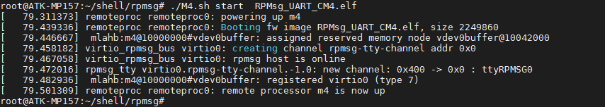
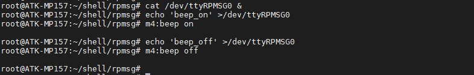
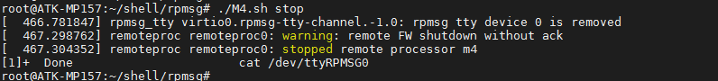

# 4.30 异核通讯测试

&emsp;&emsp;正点原子的出厂系统里已经提供了异核通讯测试，A7通过虚拟串口发送数据给M4核，M4根据A7发过来的数据去控制蜂鸣器。（注：本实验源码可在开发板光盘A-基础资料\09、文档教程(非常重要)\【正点原子】STM32MP1异核通讯V1.x.pdf找到，关于异核通讯请看【正点原子】STM32MP1异核通讯教程，本实验不讲解）

&emsp;&emsp;M4固件在/lib/firmware/目录下，名为RPMsg_UART_CM4.elf文件。脚本在/home/root/shell/rpmsg/目录下，名为M4.sh文件。

&emsp;&emsp;测试方法为：

```c#
cd /home/root/shell/rpmsg/
./M4.sh start  RPMsg_UART_CM4.elf //运行脚本，开启异核通讯
```

&emsp;&emsp;start：表示开启异核通讯。

&emsp;&emsp;RPMsg_UART_CM4.elf：要加载的M4固件，必须把M4固件拷贝到/lib/firmware/下。

&emsp;&emsp;运行结果如下所示：

<center>
<br />
图4.30 1 加载M4固件打印信息
</center>

&emsp;&emsp;从图4.30.1中可以看出在/dev/目录下生成一个虚拟串口名为‘ttyRPMSG0’，可以给此串口发送信息去用M4控制蜂鸣器。

&emsp;&emsp;控制方法如下命令：

```c#
cat /dev/ttyRPMSG0 &            //接收 M4 发过来的数据
echo 'beep_on' >/dev/ttyRPMSG0  //通过 ttyRPMSG0 来发送数据，启动 M4 控制的蜂鸣器
echo 'beep_off' >/dev/ttyRPMSG0 //关闭 M4 控制的蜂鸣器
```

&emsp;&emsp;结果如下所示：

<center>
<br />
图4.30 2 测试异核通讯
</center>

&emsp;&emsp;关闭M4核命令如下：

```c#
./M4.sh stop
```

&emsp;&emsp;stop：表示关闭M4核。

&emsp;&emsp;结果如下所示：

<center>
<br />
图4.30 3 关闭M4核
</center>


