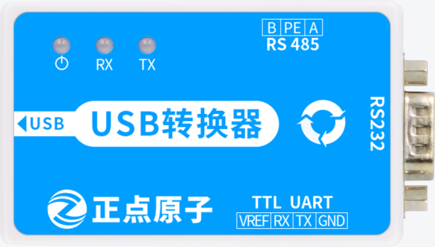

# 4.4 串口测试

&emsp;&emsp;ATK-STM32MP157底板上串口有以下几组，不包括引出的IO。

<div class="stm32mp157_center-table-div">
<table class="stm32mp157_center-table">
  <tr>
    <th>串口类型</th>
    <th>对应的串口</th>
    <th>设备名</th>
  </tr>
  <tr>
    <td>com2(DB9公头)/RS485</td>
    <td>usart3</td>
    <td>ttySTM1</td>
  </tr>
  <tr>
    <td>com1(DB9母头)</td>
    <td>uart5</td>
    <td>ttySTM2</td>
  </tr>
  <tr>
    <td>USB_TTL</td>
    <td>uart4</td>
    <td>ttySTM0</td>
  </tr>
</table>
</div>


&emsp;&emsp;由于USB_TTL是我们的调试串口，我们在开发板启动时能正常打印和输入信息，说明这个串口是可以正常工作的，就可以不用再测试了。

## 4.4.1 DB9串口测试

<div class="stm32mp157_center-table-div">
<table class="stm32mp157_center-table">
  <tr>
    <th>STM32MP157</th>
    <th>MINI STM32MP157</th>
  </tr>
  <tr>
    <td>支持</td>
    <td>不支持</td>
  </tr>
</table>
</div>


&emsp;&emsp;从上表可以知道，我们的DB9类型串口有两个，分别是com2(母头)和com1(公头)，所以用户需要准备USB转RS232公头串口线，和USB转232母头串口线。如下图，

<center>
<br />
图4.4.1 1 USB转RS232母头
</center>

<center>
<br />
图4.4.1 2 USB转RS232公头
</center>


### 4.4.1.1 DB9公头(com2)测试

&emsp;&emsp;在4.4小节可以知道DB9公头（com2）硬件连接是接在usart3处，由于DB9公头的tx和rx与RS485的tx和rx可通过跳线帽接在usart3处，所以我们测试前需要通过跳线帽去切换连接，如下图图4.4.1 3。将DB9公头com2的tx和rx分别接到usart3处的rx和tx处。再用USB转232母头接到开发板com2处。如下图图4.4.1 3。


<center>
<br />
图4.4.1.1 1底板DB9公头(com2)接口接USB转母头RS232
</center>

&emsp;&emsp;通过下面的指令配置串口

```c#
stty -F /dev/ttySTM1 ispeed 115200 ospeed 115200 cs8
```

&emsp;&emsp;stty指令解释：<br />
&emsp;&emsp;（1）	-F(--file)：打开指定的设备,并用此设备作为输入来代替标准输入<br />
&emsp;&emsp;（2）	ispeed N：设置输入速率为N<br />
&emsp;&emsp;（3）	ospeed N： 设置输出速率为N<br />
&emsp;&emsp;（4）	csN：把字符长度设为N

&emsp;&emsp;更多关于该指令用法请输入stty -help查看

&emsp;&emsp;输入如下指令等待上位机发来的数据，注意不要发中文，否则可能会乱码。按Ctrl+c结束接收。

```c#
cat /dev/ttySTM1
```

<center>
<br />
图4.4.1.1 2 等待串口发来的数据
</center>


&emsp;&emsp;同时在上位机上也会返回发送的数据，注意使用cat这种方法只能简单测试串口的功能，不代表实际项目上测试。推荐使用minicom测试，这里就不介绍minicom的使用了，在《【正点原子】STM32MP1嵌入式Linux驱动开发指南》第45.6.2小节已经讲过，推荐找这章节的内容看。

<center>
<br />
图4.4.1.1 3 XCOM上位机发送“www.openedv.com”给串口
</center>


### 4.4.1.2 DB9母头(com1)测试

&emsp;&emsp;在4.4小节可以知道DB9母头（com1）硬件连接是接在uart5处，由于DB9母头的tx和rx与ATK MODULE的tx和rx可通过跳线帽接在uart5处，所以我们测试前需要通过跳线帽去切换连接，如下图。将DB9母头com1的tx和rx分别接到uart5处的rx和tx处。再用USB转232公头接到开发板com1处。如下图。


<center>
<br />
图4.4.1.2 1底板DB9母头(com1)接USB转RS232公头
</center>

&emsp;&emsp;通过下面的指令配置串口

```c#
stty -F /dev/ttySTM2 ispeed 115200 ospeed 115200 cs8
```

&emsp;&emsp;余下的测试与4.4.1.1小节一样，不再重复叙述。


## 4.4.2 RS485串口测试

&emsp;&emsp;在4.4.1.1小节我们可以知道，com2与RS485可以通过跳线帽切换连接到usart3。测试前我们先切换跳线帽，连接RS485到usart3。在这里我们需要借助正点原子USB转换器模块来测试，如果用户有485相关测试工具可以自行测试，不一定要用这个模块。如下图。

<center>
<br />
图4.4.2 1 正点原子多合一USB转换器模块
</center>

&emsp;&emsp;将底板的RS485的A用杜邦线连接到正点原子USB转换器模块的A处，B连接到B。使用了正点原子的USB转换器模块，会在PC(电脑端)看到一个串口。测试方法按4.4.1.1小节步骤来测试即可，无需改动。


