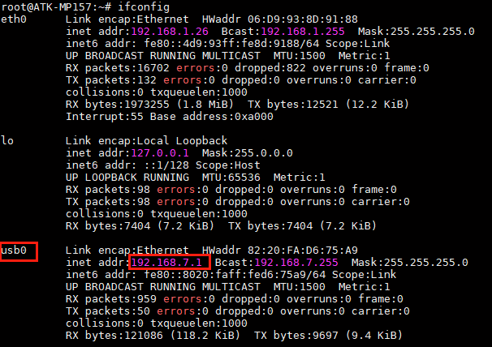

# 4.5 USB测试

## 4.5.1 USB HOST测试

&emsp;&emsp;将一张FAT32格式的U盘用读卡器，直接插在ATK-STM32MP157底板的USB_CN1或USB_CN2或USB_CN3的USB接口上，如下图。

<center>
<br />
图4.5.1 1 U盘挂载的信息
</center>

&emsp;&emsp;我们可以直接进入/run/media/sda1目录进入读写文件操作。

&emsp;&emsp;读速度测试：

```c#
hdparm -t /dev/sda1
```

<center>
<br />
图4.5.1 2 读取速度评测
</center>

&emsp;&emsp;写速度测试：

```c#
time dd if=/dev/zero of=/run/media/sda1/test bs=1024k count=100 conv=fdatasync
rm /run/media/sda1/test  //写完后删除写入的文件
```

<center>
<br />
图4.5.1 3 写速度评测
</center>

&emsp;&emsp;这里代表写入100MiB的文件，写入速度为17.6 MB/s。实际上写入的文件越大求平均写入速度越接近实际值。

## 4.5.2 USB OTG测试（OTG网络）

&emsp;&emsp;ATK-STMMP157底板上USB-OTG接口，可当作USB网络使用（局域网）。
我们使用一根USB Type-C连接线连接USB_OTG接口到PC(电脑)。

<center>
<br />
图4.5.2 1 USB_OTG连接（PC）电脑
</center>

&emsp;&emsp;USB-OTG在系统启动后，USB-OTG会生成一个usb0网络节点。我们可以使用ifconfig指令查看。

<center>
<br />
图4.5.2 2 生成的usb0网络节点
</center>

&emsp;&emsp;打开Ubuntu虚拟机，按如下步骤操作，将PC（电脑）识别的可移动设备连接到虚拟机上。

<center>
<br />
图4.5.2 3 将USB_OTG设备连接到Ubuntu虚拟机
</center>


<center>
<br />
图4.5.2 4 查看开发板获取的USB_OTG网络ip地址
</center>

&emsp;&emsp;并且Ubuntu虚拟机上，生成一个网络节点。在Ubuntu使用ifconfig命令查看。并且是与ATK-STM32MP157相同一个网段的ip。所以它们构成了一个局域网，可以使用网络进行通信或者传输文件等操作！

<center>
<br />
图4.5.2 5 Ubuntu获取USB_OTG的ip地址
</center>


## 4.5.3 USB鼠标测试

&emsp;&emsp;在出厂系统启动后，插上鼠标，LCD屏幕或连接HDMI到显示屏，屏上会显示鼠标指针，即可用鼠标操作Qt界面。


