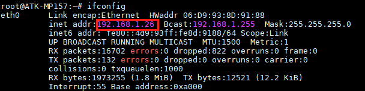
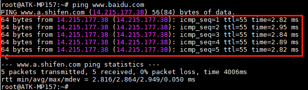
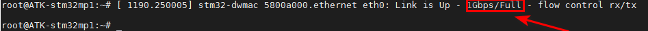

# 4.6 网络测试

&emsp;&emsp;ATK-STMMP157核心板上搭载一颗千兆网络芯片，CPU只支持一路千兆网络，自适应10/100/1000M。

&emsp;&emsp;在文件系统使用如下指令测试网络，将网线插在网口处，确保网线能上网。

&emsp;&emsp;查看网络获取的IP

```c#
ifconfig
```

<center>
<br />
图4.6.1 eth0获取的ip地址
</center>

&emsp;&emsp;检查网络能否上网，如果有数据回复，则说明网络功能正常。按Ctrl+c终止指令。

```c#
ping www.baidu.com
```

<center>
<br />
图4.6 2 ping百度
</center>

&emsp;&emsp;测试是否为千兆网络，注意要使用千兆网线，千兆路由器或者千兆交换机，PC（电脑）网卡必须是千兆网卡，否则测试出来的速度或识别出来的速度可能是百兆的！
如下图，看到软件识别为1Gbps/Full代表是千兆网络。


<center>
<br />
图4.6 3 识别为千兆网络
</center>

&emsp;&emsp;使用iperf3指令可测试千兆网络的连接速度

&emsp;&emsp;设置Ubuntu为服务器

```c#
iperf3  -s
```

&emsp;&emsp;ATK-STM32MP157为客户端，通过iperf指令，输入服务器的ip即可

```c#
iperf3  -c 192.168.1.11 -i 1
```

&emsp;&emsp;解释：<br />
&emsp;&emsp;（1）	192.168.1.11： Ubuntu服务器的ip地址。<br />
&emsp;&emsp;（2）	-i：触发周期。

&emsp;&emsp;测试出来的Bitrate大概为800 Mbits/sec左右才是千兆网络速度(测试前请不要开启其他应用，以免影响测试速度)，如果不是，请检查是否使用了千兆网线、PC电脑的网卡是不是千兆网卡，通过的路由器是不是千兆的等，不能有一个为百兆的设备，否则测试出来的是百兆网络。


