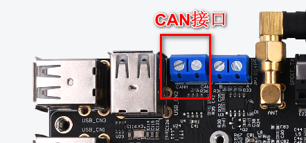
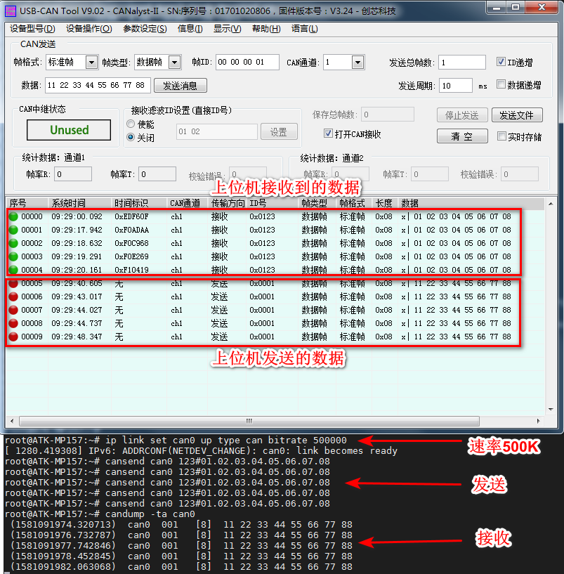
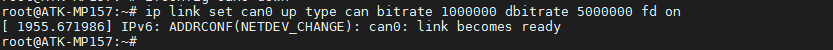
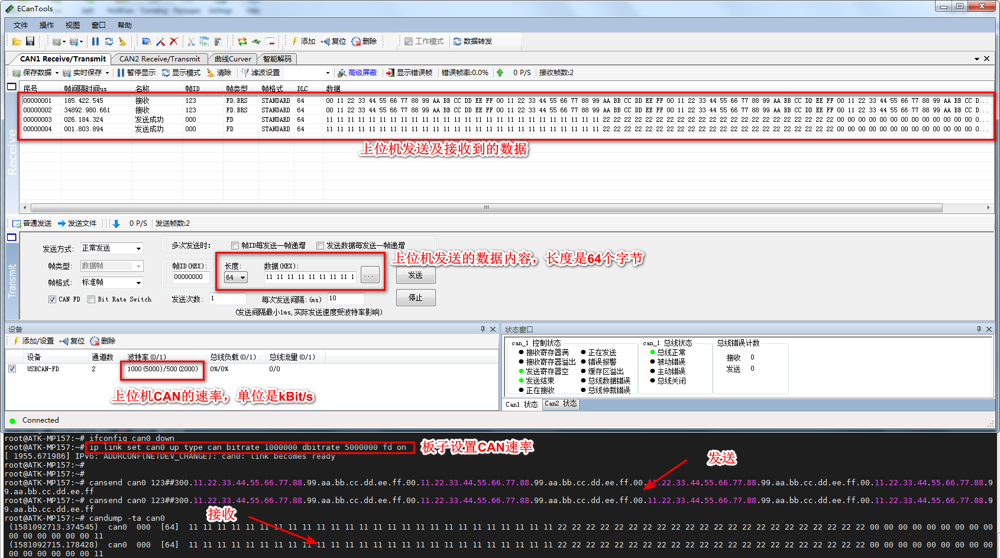

# 4.7 CAN

&emsp;&emsp;ATK-STM32MP157底板上有一路CAN ，要想测试CAN，用户手上需要有测试CAN的仪器，（否则只能用两块不同的开发板的CAN或者其他CAN设备测试）比如周立功的CAN分析仪、创芯科技的CAN分析仪和广成科技的CAN分析仪等。或者可用两个CAN设备对接相互收发。关于CAN仪器及CAN上位机的使用，请参照各厂商的使用说明书，如不会使用请咨询CAN厂家的技术支持。

&emsp;&emsp;正点原子底板所使用的CAN的主要特性如下：<br />
&emsp;&emsp; -	CAN FD可以理解成CAN协议的升级版，只升级了协议，物理层未改变。<br />
&emsp;&emsp; -	CAN与CAN FD主要区别：传输速率不同、数据长度不同、帧格式不同、ID长度不同。<br />
&emsp;&emsp; - 	数据比特率最高5Mbps。<br />
&emsp;&emsp; -	数据比特率理论最低40kbps。


&emsp;&emsp;测试前请使用CAN分析仪或者测试CAN的设备连接好ATK-STM32MP157底板的CAN，CANH接仪器的CANH，CANL接CAN仪器的CANL。

&emsp;&emsp;底板接口如下图位置

<center>
<br />
图4.7 1 CAN接口位置
</center>

## 4.7.1 CAN测试

&emsp;&emsp;经过测试CAN最低数据比特率10kBit/s（此款CAN芯片理论最低为40kbps），最高数据1000kBit/s。

```c#
ip link set can0 up type can bitrate 500000 
```

&emsp;&emsp;使用cansend指令发送数据。

```c#
cansend can0 123#01.02.03.04.05.06.07.08
```

&emsp;&emsp;解释：<br />
&emsp;&emsp;（1）	can0设备<br />
&emsp;&emsp;（2）	123：帧ID<br />
&emsp;&emsp;（3）	01.02.03.04.05.06.07.08：帧数据

&emsp;&emsp;接收则可以使用candump指令来接收数据

```c#
candump -ta can0
```

&emsp;&emsp;解释：<br />
&emsp;&emsp;（1）	-ta: t代表打印时间，a代表开启ASCII输出

&emsp;&emsp;使用创芯科技CAN分析仪设置CAN的速率为500000做的实验结果如下图

<center>
<br />
图4.7.1 1使用上位机与开发板CAN收发
</center>

## 4.7.2 CAN FD测试

&emsp;&emsp;经过测试CAN FD的波特率最高为1000 kBit/s，数据波特率为5000 kBit/s。
可用的速率如下，如需要使用更低的波特率，请使用CAN，而非CAN FD。需要重新设置CAN FD速率，先关闭CAN，再设置CAN的速率，如果不成功请重启板子或者上位机软件。

```c#
ifconfig can0 down
```

&emsp;&emsp;配置CAN FD的速率，三选一，其他速率自行测试。只需要选择下面其中一条指令来配置即可。

```c#
ip link set can0 up type can bitrate 1000000 dbitrate 5000000 fd on
ip link set can0 up type can bitrate 200000 dbitrate 1000000 fd on
ip link set can0 up type can bitrate 100000 dbitrate 500000 fd on
```

&emsp;&emsp;本次设置最高的波特率最高为1000 kBit/s，数据波特率为5000 kBit/s进行测试。

```c#
ip link set can0 up type can bitrate 1000000 dbitrate 5000000 fd on
```

<center>
<br />
图4.7.2 1 开发板设置CAN
</center>

&emsp;&emsp;CAN FD发送数据，下图为一行指令，请分行复制！

```c#
cansend can0 123##300.11.22.33.44.55.66.77.88.99.aa.bb.cc.dd.ee.ff.00.11.22.33.44.55.66.77.88.99.aa.bb.cc.dd.ee.ff.00.11.22.33.44.55.66.77.88.99.aa.bb.cc.dd.ee.ff.00.11.22.33.44.55.66.77.88.99.aa.bb.cc.dd.ee.ff
```

&emsp;&emsp;解释：<br />
&emsp;&emsp;（1）	can0: can设备<br />
&emsp;&emsp;（2）	123: 帧ID<br />
&emsp;&emsp;（3）	3：标志（flags）<br />
&emsp;&emsp;（4）	00.11.22…: 帧数据

&emsp;&emsp;接收则可以使用candump指令来接收数据

&emsp;&emsp;解释：<br />
&emsp;&emsp;（1）	-ta: t代表打印时间，a代表开启ASCII输出

&emsp;&emsp;下面是使用广成科技的CAN FD分析仪使用波特率最高1000 kBit/s，数据波特率最高5000 kBit/s测试的结果。（上位机是广成科技V5.9.24版本的上位机软件（咨询广成科技技术获取最新上位机软件），注意上位机的使用及安装，请根据各厂家的CAN分析仪使用说明）

<center>
<br />
图4.7.2 2使用上位机与开发板CAN收发
</center>


