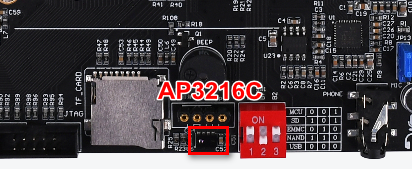
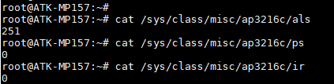

# 4.9 AP3216C测试

<div class="stm32mp157_center-table-div">
<table class="stm32mp157_center-table">
  <tr>
    <th>STM32MP157</th>
    <th>MINI STM32MP157</th>
  </tr>
  <tr>
    <td>支持</td>
    <td>不支持</td>
  </tr>
</table>
</div>


&emsp;&emsp;AP3216C简介：

&emsp;&emsp;ALPHA开发板上通过 I2C5 连接了一个三合一环境传感器：AP3216C，AP3216C 是由敦南可以推出的一款传感器，其支持环境光强度(ALS)、接近距离(PS)和红外线强度(IR)这三个环境参数检测。AP3216C 的特点如下：

&emsp;&emsp;I2C 接口，快速模式下波特率可以到 400Kbit/S<br />
&emsp;&emsp;多种工作模式选择：ALS、PS+IR、ALS+PS+IR、PD 等等<br />
&emsp;&emsp;内建温度补偿电路<br />
&emsp;&emsp;宽工作温度范围(-30°C ~ +80°C)<br />
&emsp;&emsp;超小封装，4.1mm x 2.4mm x 1.35mm<br />
&emsp;&emsp;环境光传感器具有 16 为分辨率<br />
&emsp;&emsp;接近传感器和红外传感器具有 10 为分辨率<br />


&emsp;&emsp;AP3216C 常被用于手机、平板、导航设备等，其内置的接近传感器可以用于检测是否有物体接近，比如手机上用来检测耳朵是否接触听筒，如果检测到的话就表示正在打电话，手机就会关闭手机屏幕以省电。也可以使用环境光传感器检测光照强度，可以实现自动背光亮度调节。

&emsp;&emsp;AP3216C元器件在ATK-STM32MP157底板位置如下


<center>
<br />
图4.9 1 AP3216C在开发板的位置
</center>

&emsp;&emsp;由正点原子提供驱动程序，源码路径为出厂源码drivers/char/ap3216c.c。设备树arch/arm/boot/dts/stm32mp157d-atk.dtsi配置如下：

```c#
&i2c5 {
    pinctrl-names = "default", "sleep";
    pinctrl-0 = <&i2c5_pins_a>;
    pinctrl-1 = <&i2c5_pins_sleep_a>;
    i2c-scl-rising-time-ns = <100>;
    i2c-scl-falling-time-ns = <7>;
    status = "okay";
    /delete-property/dmas;
    /delete-property/dma-names;

    ap3216c@1e {
        compatible = "LiteOn,ap3216c";
        reg = <0x1e>;
    };
…//此处省略其他设备配置
};
```


&emsp;&emsp;进入开发板文件系统执行下面指令读取环境传感器的环境参数值，根据开发板所处环境不同，环境参数值不同，先用下面指令读取一次环境参数值，再用手接近AP3216C传感器（ATK-STM32MP157底板U6处(在TF卡旁边），再用指令读取相应的参数值，参数值会有比较大的变化，注意读出来的数据是原始数据，需要经过转化才为实际值。

&emsp;&emsp;读取环境光强度值(ALS)

```c#
cat /sys/class/misc/ap3216c/als
```

&emsp;&emsp;读取接近距离(PS)

```c#
cat /sys/class/misc/ap3216c/ps
```

&emsp;&emsp;读取红外线强度(IR)

```c#
cat /sys/class/misc/ap3216c/ir
```

<center>
<br />
图4.9 2 读取出来的数据
</center>


