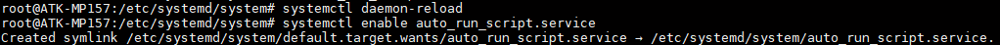
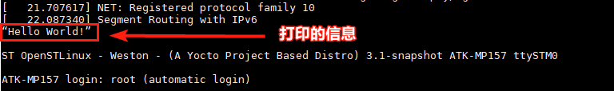

# 5.3 如何创建systemd 自启动服务

&emsp;&emsp;想开机自启动程序，可以在/etc/profile.d/qt-eglfs.sh这个文件里添加启动程序的指令。也可以自己创建新的系统服务，让系统启动起来时自动执行。如果觉得麻烦，可以参考5.5小节，不使用systemd创建自启动程序。

&emsp;&emsp;我们先创建一个要启动的脚本

```c#
vi auto_run_script.sh
```

&emsp;&emsp;在脚本里添加以下内容，脚本内容是打印信息到串口。

```c#
#!/bin/bash
echo “Hello World!”> /dev/ttySTM0
```

&emsp;&emsp;赋予脚本可执行权限，执行下面的指令

```c#
chmod +x auto_run_script.sh
```

&emsp;&emsp;我们进入/etc/systemd/system目录下，创建一个自启动服务

```c#
auto_run_script.service。
cd /etc/systemd/system
vi auto_run_script.service
```

&emsp;&emsp;在auto_run_script.service里添加以下内容

```c#
[Unit]
Description=Run a Custom Script at Startup
After=default.target

[Service]
ExecStart=/home/root/auto_run_script.sh

[Install]
WantedBy=default.target
```

&emsp;&emsp;然后我们使用更新 systemd 配置文件，并建立符号链接关系

```c#
systemctl daemon-reload
systemctl enable auto_run_script.service
```

<center>
<br />
图5.1 1 更新配置文件，建立符号链接
</center>

&emsp;&emsp;再执行重启命令reboot

```c#
sync;reboot
```

&emsp;&emsp;重启时看到打印该服务的描述信息及打印脚本的信息，表明已经执行了自启动脚本。

<center>
<br />
图5.1 2 重启后，服务自启动打印的信息
</center>


