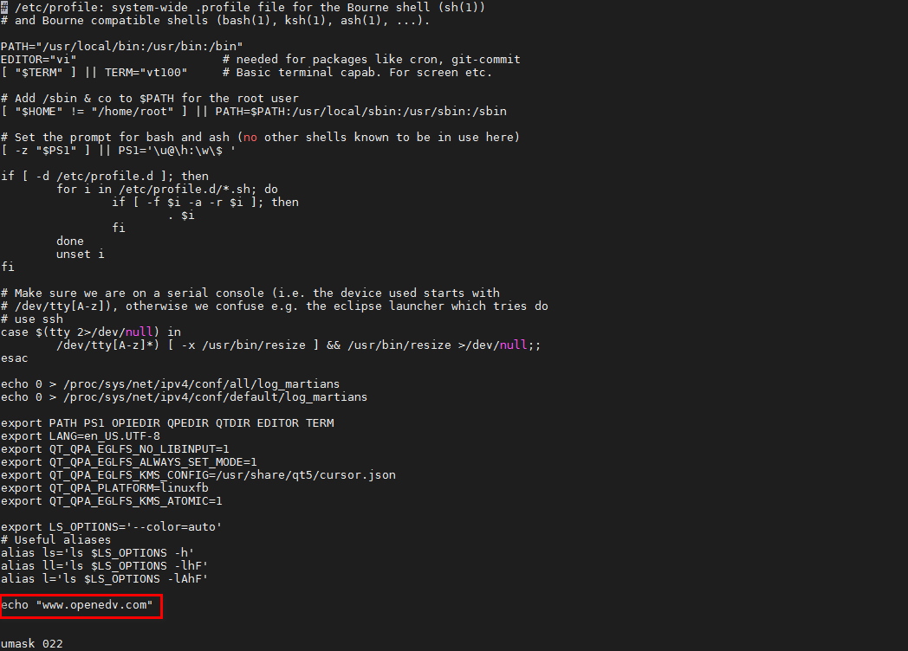
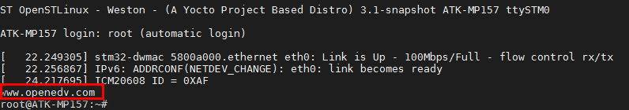

# 5.5 如何不使用systemd服务自启动程序

&emsp;&emsp;相信大家一样，习惯了sysvinit的方式启动应用程序。systemd的方式相对来说是复杂了些。考虑到大家不习惯用systemd，降低开发难度。那么我们也可以将自启动程序写在一个文件里。开机将自动执行它，建议**用户的Qt应用放在/etc/profile**文件里，因为出厂的Qt程序比较大，启动过慢才放到systemd服务里，这样的目的是让Qt应用提早执行。

&emsp;&emsp;因为/etc/profile这个文件，系统开机会自动执行且这个文件执行的时间为刚登入系统前，所以我们可以将自启动的写到这个文件中。

```c#
vi /etc/profile
```

&emsp;&emsp;输入echo "www.openedv.com" 如下位置。


<center>

</center>

&emsp;&emsp;重启开发板后，在串口终端打印如下。打印出“www.openedv.com”。


<center>

</center>

&emsp;&emsp;如果是想运行自己的Qt程序的，可以参考下面的格式，比如我这里/home/root/路径下的一个Qt可执行文件名为demo

```c#
/home/root/demo >/dev/null 2>&1 &	
```


