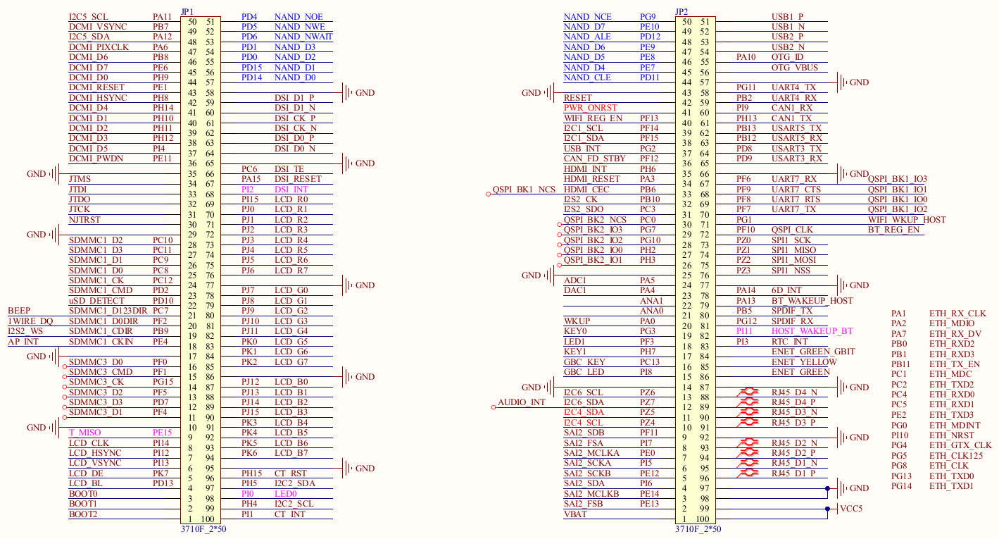

# 2.2 工业级核心板ATK-CLMP157BI

## 2.1.1 硬件参数

| **参数项**     | **参数**                                | **备注**                                                     |      |
| -------------- | --------------------------------------- | ------------------------------------------------------------ | ---- |
| 核心板尺寸规格 | 60mm*45mm                               |                                                              |      |
| 处理器型号     | STM32MP157AAA3                          | LFPBGA448封装                                                |      |
| CPU            | 双核CortexA7@650MHz+单核CortexM4@209MHz |                                                              |      |
| 内存           | 工业级1GB(2*512MB) DDR3L                | 受芯片供货影响，可能会有多种不同厂家的芯片，一切以实际贴片的型号为准。 |      |
| 存储           | 工业级8GB EMMC                          | 受芯片供货影响，可能会有多种不同厂家的芯片，一切以实际贴片的型号为准。 |      |
| 板载PHY        | 工业级千兆PHY芯片                       |                                                              |      |
| 工作电压       | 5V/0.5A                                 | 输入核心板                                                   |      |
| 功耗           | 小于1W                                  | 只使用核心板                                                 |      |
| 运行温度       | 工业级：-40℃ ~ 80℃                      |                                                              |      |
| 引脚数         | 200Pin                                  |                                                              |      |
| 引脚间距       | 0.8mm                                   | 核心板座子引脚间距                                           |      |
| 核心板连接方式 | 两个2*50的防反插BTB座，板对板连接       |                                                              |      |
| PCB工艺        | 8层，独立接地信号层                     |                                                              |      |

## 2.2.2 引脚顺序及引出接口信号

## 2.2.3 核心板引脚可复用资源

&emsp;&emsp;核心板引出了处理器上的所有IO，用户可以根据自己需要，自行设计底板来运用核心板上IO资源，将IO复用成自己所需要的功能。

&emsp;&emsp;根据外设功能，此处列举ATK-CLMP157BI核心板可复用的单项外设最大资源数，具体选型可以结合芯片数据手册。（单项外设最大资源数：指的是在不使用其他外设的前提下，核心板所能使用的某项外设的最大数量）

| **管脚外设功能** | **单项外设最大复用数** | **管脚外设功能** | **单项外设最大复用数**  |
| ---------------- | ---------------------- | ---------------- | ----------------------- |
| GPIO             | 144个                  | Ethernet         | 1个，千兆网络           |
| ADC              | 2路，每路20个通道      | SDIO             | 3个                     |
| DAC              | 1路，共2个输出通道     | MIPI DSI         | 1个                     |
| PWM              | 32路                   | RGB LCD          | 1个，最大1366*768分辨率 |
| U(S)ART          | 4个USRT+4个USART       | Camera           | 1个                     |
| I2C              | 6个                    | USB OTG          | 2个                     |
| SPI              | 6个                    | SAI              | 4个                     |
| CAN FD           | 2个                    | I2S              | 3个                     |
| 16位定时器       | 12个                   | 32位定时器       | 2个                     |
| 电机定时器       | 2个                    | 3D GPU           | 1个                     |

