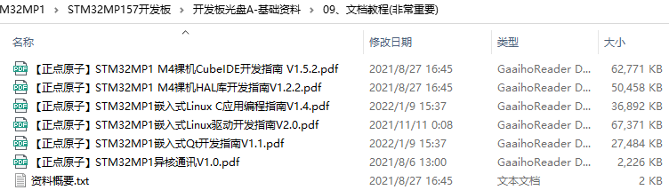
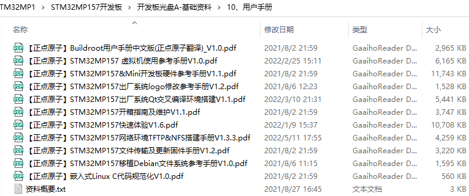
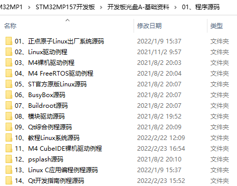

# 6 开发资料

&emsp;&emsp;核心板资料和开发板资料在同一份网盘里，ATK-DLMP157开发板和ATK-DLMP157M开发板的资料是通用的。也就是说，正点原子MP157相关产品共用一份网盘资料。

&emsp;&emsp;开发板&核心板资料链接：https://pan.baidu.com/s/1cBc13o-XWOiTUc-Dl7gTmg  
&emsp;&emsp;提取码：8xo9

&emsp;&emsp;下载中心：http://www.openedv.com/docs/boards/arm-linux/zdyzmp157.html

&emsp;&emsp;部分资料截图：

