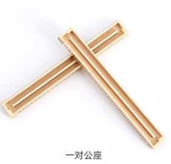

# 7.2 板对板连接器（BTB座子）

&emsp;&emsp;如果是用ATK-CLMP157B核心板做产品设计的，需要在底板上使用一对板对板连接器（公座）2*50 端子，才能搭配ATK-CLMP157B核心板使用。核心板自带的是母座，因此底板上要用公座。

&emsp;&emsp;购买链接：https://detail.tmall.com/item.htm?spm=a1z10.3-b.w4011-22301073509.34.23a674676ry8DU&id=632639855948&rn=f6c986dff597d58b919817caf4151c9b&abbucket=5&skuId=4510712517772

