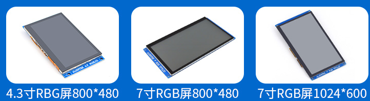

# 7.3 LCD屏幕

&emsp;&emsp;正点原子ATK-DLMP157开发板支持多款RGB电容触摸屏幕，如下图：

&emsp;&emsp;以上屏幕都是并行24位色RGB888/565接口，支持多点触摸。具体参数可以在各个屏幕的购买链接里查看。开发板出厂系统上已经添加这些屏幕的驱动，可以直接使用。

&emsp;&emsp;配件购买链接：https://zhengdianyuanzi.tmall.com/category-1498161556.htm?spm=a1z10.5-b.0.0.7b1b5bfbKaIXHK&search=y&parentCatId=1498161504&parentCatName=ARM+Linux%BF%AA%B7%A2%B0%E5&catName=%BF%AA%B7%A2%B0%E5%C5%E4%BC%FE

&emsp;&emsp;10.1寸屏购买链接：
https://detail.tmall.com/item.htm?spm=a220o.1000855.0.0.4a96558f7dYU2c&id=609034096308

