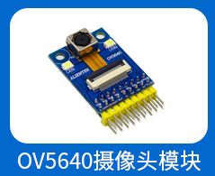

# 7.4 摄像头模组

&emsp;&emsp;正点原子ATK-DLMP157开发板支持摄像头模组，如下图：

&emsp;&emsp;出厂系统默认配置OV5640摄像头驱动，可以直接使用。

&emsp;&emsp;OV5640购买链接：
https://detail.tmall.com/item.htm?spm=a220o.1000855.0.0.1b3e5513vu7v1f&id=609758211612

