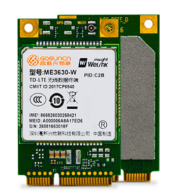

# 7.5 4G模块ME3630

&emsp;&emsp;正点原子ATK-DLMP157开发板可以使用ME3630-C3B-MP01 /ME3630-C3C-MP01这种4G模组。其中，ME3630-C3B-MP01是全网通，不支持GPS。ME3630-C3C-MP01是全网通，支持GPS。SIM卡槽在STM32MP157底板上。

&emsp;&emsp;购买链接：
https://detail.tmall.com/item.htm?spm=a1z10.5-b.w4011-22300975877.81.44e748f5CiJmlw&id=609033604453&rn=e531d6e516b89557ce22be7a320c7533&abbucket=5&skuId=4279654048937

