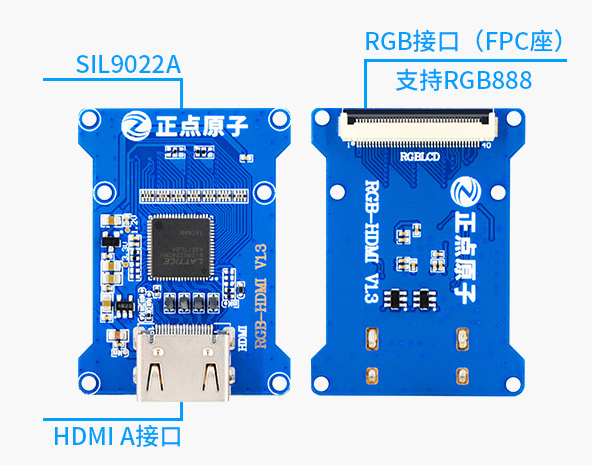

# 7.6 RGB转HDMI模块

&emsp;&emsp;ATK-DLMP157M开发板搭配这个HDMI模块，可以连接到外部HDMI显示器显示，显示效果最大为1366*768，出厂系统默认配置720P效果。

&emsp;&emsp;购买链接：
https://detail.tmall.com/item.htm?spm=a1z10.5-b.w4011-22300975877.96.44e748f5CiJmlw&id=615444223625&rn=e531d6e516b89557ce22be7a320c7533&abbucket=5

