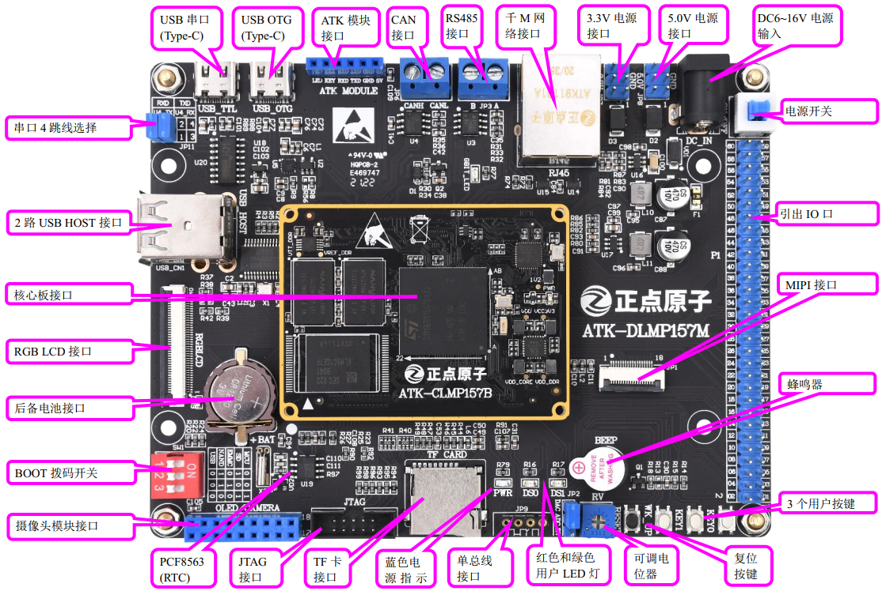

# 1.1.2 STM32MP157-Mini开发板底板资源

&emsp;&emsp;我们再来看一下STM32MP157-Mini开发板的底板资源图，如图1.1.2.1所示：

 
图1.1.2.1 STM32MP157-Mini开发板底板资源图

&emsp;&emsp;从图1.1.2.1可以看出，STM32MP157-Mini开发板底板是在STM32MP157开发板的基础上精简而来的，保留了基本的外设资源。成本更低，方便学生朋友们来购买学习STM32MP157的开发。

&emsp;&emsp;开发板的外形尺寸为130mm*100mm大小，板子的设计充分考虑了人性化设计，并结合正点原子多年的开发板设计经验，经过多次改进，最终确定了这样的设计。

&emsp;&emsp;正点原子STM32MP157-Mini开发板底板板载资源如下： 
&emsp;&emsp;◆	1个核心板接口，支持STM32MP157核心板 
&emsp;&emsp;◆	1个电源指示灯（蓝色） 
&emsp;&emsp;◆	2个状态指示灯（红色和绿色，用户可以使用） 
&emsp;&emsp;◆	1路CAN FD接口，采用MCP2526FDT芯片 
&emsp;&emsp;◆	1路485接口，采用SP3485芯片 
&emsp;&emsp;◆	1个ATK模块接口，支持正点原子蓝牙/GPS/MPU6050/手势识别等模块 
&emsp;&emsp;◆	1个摄像头模块接口 
&emsp;&emsp;◆	1个OLED模块接口 
&emsp;&emsp;◆	1个USB串口，可用于代码调试，Type-C接口类型 
&emsp;&emsp;◆	1个USB OTG接口，用于USB从机通信，Type-C接口类型 
&emsp;&emsp;◆	2个USB HOST接口，用连接USB设备  
&emsp;&emsp;◆	1个有源蜂鸣器  
&emsp;&emsp;◆	1个TF卡接口 
&emsp;&emsp;◆	1个10M/100M/1000M以太网接口（RJ45）  
&emsp;&emsp;◆	1组5V电源供应/接入口 
&emsp;&emsp;◆	1组3.3V电源供应/接入口 
&emsp;&emsp;◆	1个直流电源输入接口（输入电压范围：DC6~16V）  
&emsp;&emsp;◆	1个启动模式选择配置接口 
&emsp;&emsp;◆	1个RTC后备电池座，并带电池 
&emsp;&emsp;◆	1个复位按钮，可用于复位MPU和LCD 
&emsp;&emsp;◆	3个功能按钮 
&emsp;&emsp;◆	1个电源开关，控制整个板的电源  
&emsp;&emsp;◆	1个JTAG调试接口，可以调试M4内核 
&emsp;&emsp;◆	1个可调电位器，用于ADC测试 
&emsp;&emsp;◆	1个4P的圆孔排座，可以接DHT11或DS18B20温湿度传感器 
&emsp;&emsp;◆	1个2×30P，2.54mm间距的排针，引出60个IO，用户可自行使用

&emsp;&emsp;正点原子STM32MP157 Mini开发板底板的特点包括： 
&emsp;&emsp;1)、接口丰富。板子提供多种标准接口，可以方便的进行各种外设的实验和开发。 
&emsp;&emsp;2)、设计灵活。我们采用核心板+转接板+底板形式，板上很多资源都可以灵活配置，以满足不同条件下的使用。 
&emsp;&emsp;3)、资源丰富。板载FD CAN、USB HOST、千兆网卡等以及各种接口芯片，满足各种应用需求。 
&emsp;&emsp;4)、人性化设计。各个接口都有丝印标注，且用方框框出，使用起来一目了然；部分常用外设大丝印标出，方便查找；接口位置设计合理，方便顺手。资源搭配合理，物尽其用。

