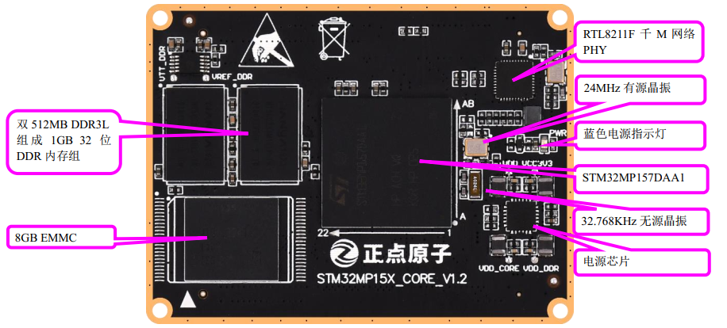

# 1.1.3 STM32MP157核心板资源

&emsp;&emsp;接下来，我们来看STM32MP157核心板资源图，如图1.1.3.1所示：

 
图1.1.3.1 STM32MP157接口核心板资源图

&emsp;&emsp;从图5.1.3.1可以看出，STM32MP157核心板板载资源丰富，可以满足各种应用的需求。整个核心板的外形尺寸为60mm*45mm大小，非常小巧，并且采用了贴片板对板连接器，使得其可以很方便的应用在各种项目上。

&emsp;&emsp;正点原子STM32MP157核心板板载资源如下： 
&emsp;&emsp;◆	CPU：STM32MP157DAA1，双核A7+单核M4，A7主频800MHz，M4主频209MH，LFBGA448封装。 
&emsp;&emsp;◆	外扩DDR3L：2片NT5CC256M16EP-EK，容量为1GB(2×512MB)，位宽32位(2×16)。 
&emsp;&emsp;◆	EMMC：KLM8G1GETF，容量为8GB字节。 
&emsp;&emsp;◆	两个2*50的防反插BTB座，共引出144个GPIO以及35个其他功能引脚。

&emsp;&emsp;正点原子STM32MP157核心板的特点包括： 
&emsp;&emsp;1)、体积小巧。核心板仅60mm*45mm大小，方便使用到各种项目里面。 
&emsp;&emsp;2)、集成方便。核心板使用200P BTB连接座，可以非常方便的集成到客户PCB上，更换简单，方便维修测试。 
&emsp;&emsp;3)、资源丰富。核心板板载：1GB DDR3L、8GB EMMC存储器，可以满足各种应用需求。 
&emsp;&emsp;4)、性能稳定。核心板采用6层板设计，单独地层、电源层，且关键信号采用等长线走线，保证运行稳定、可靠。 
&emsp;&emsp;5)、人性化设计。底部放有详细丝印，方便安装；按功能分区引出IO口，方便布线。
