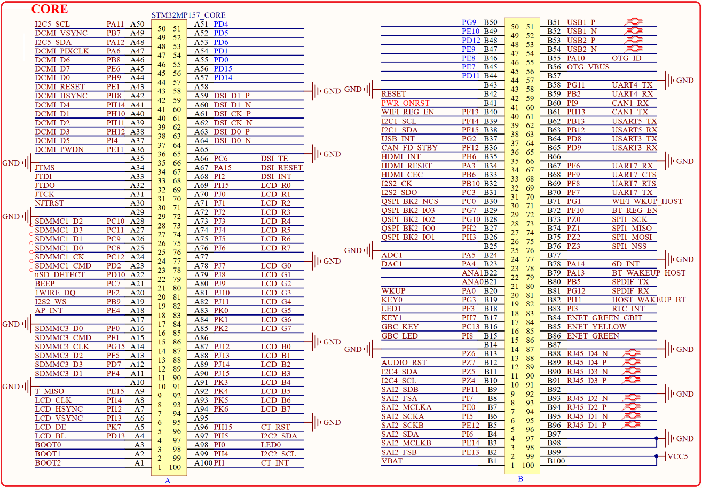

# 1.3.1 核心板接口 

&emsp;&emsp;STM32MP157开发板采用底板+核心板的形式，STM32MP157开发板底板采用2个2*50的3710F（公座）板对板连接器来同核心板连接，接插非常方便，底板上面的核心板接口原理图如图1.3.1.1所示：

 
图1.3.1.1 底板转接板接口部分原理图

&emsp;&emsp;图中的A和B就是底板上的转接板接口，由2个2*50PIN的3710F板对板公座组成，总144个GPIO以及35个其他功能引脚。

