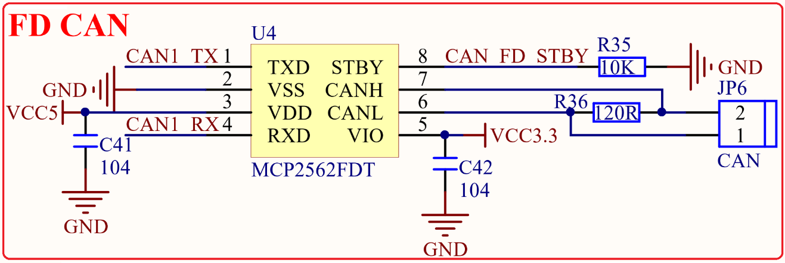

# 1.3.10 FD CAN接口

&emsp;&emsp;正点原子STM32MP157开发板板载的FD CAN接口电路如图1.3.10.1所示：

 
图1.3.10.1 FD CAN接口电路

&emsp;&emsp;FD CAN总线电平也不能直接连接到STM32MP157，同样需要电平转换芯片。这里我们使用MCP2562FDT来做CAN电平转换，其中R36为终端匹配电阻。

&emsp;&emsp;CAN1_TX/CAN1_RX直接连接在STM32MP157的PH13/PI9上面。

