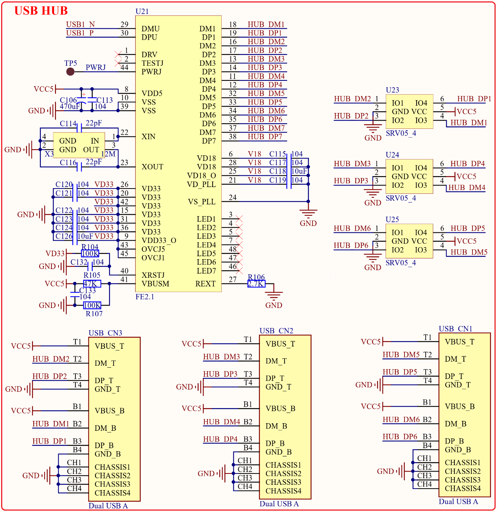

# 1.3.11 USB HUB接口

&emsp;&emsp;正点原子STM32MP157开发板板载了一颗一扩7的USB HUB芯片，用于将STM32MP157的USB1扩展为7个USB HOST接口(其中1路连接4G模块，剩余6路可以外接其他USB设备)，如图1.3.11.1所示：

 
图1.3.11.1 USB HUB接口电路

&emsp;&emsp;STM32MP157带有两个USB接口，但是对于Linux应用来说两个USB太少了，如果我们要连接鼠标、键盘、U盘等设备的时候两个USB口完全不够用。因此STM32MP157开发板通过FE2.1芯片将STM32MP157的USB1外扩出了7个USB HOST接口，其中有一路外接了4G模块，因此提供给用户的就只剩下了6个USB HOST接口，这6个USB HOST接口通过3个双层USB A座提供。图1.3.11.1中USB_CN1~USB_CN3就是这3个双层USB A座。

