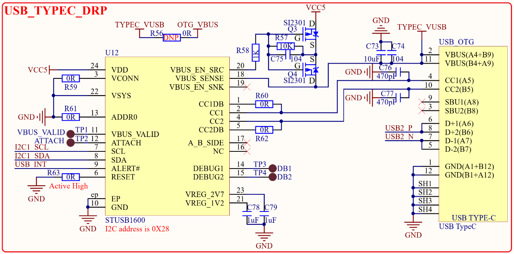

# 1.3.12 USB OTG(Type-C)接口

&emsp;&emsp;STM32MP157也有一路USB OTG接口，USB OTG接口使用了STM32MP157的USB2，USB OTG接口如图1.3.12.1所示：

 
图1.3.12.1 USB OTG接口

&emsp;&emsp;图中的USB_TYPEC_DRP就是USB_OTG，但是用的USB Type-C接口，STUSB1600是USB Type-C芯片，实现USB Type-C的DRP功能，也就是既可以作为USB从机，也可以作为USB主机。图1.3.12.1中右侧的USB_OTG就是Type-C座，我们就是通过此USB Type-C座进行系统烧写以及完成USB OTG实验，如果需要做USB OTG实验，那么还需要购买一根Type-C OTG线。

