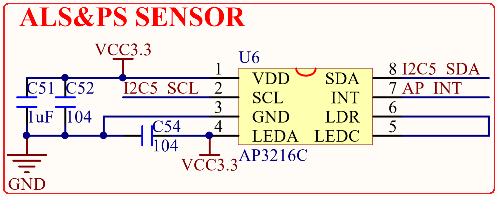

# 1.3.13 光环境传感器

&emsp;&emsp;STM32MP157开发板板载了一个光环境传感器，可以用来感应周围光线强度、接近距离和红外线强度等，该部分电路如图1.3.13.1所示：

 
图1.3.13.1 光环境传感器电路

&emsp;&emsp;图中的U6就是光环境传感器：AP3216C，它集成了光照强度、近距离、红外三个传感器功能于一身，被广泛应用于各种智能手机。该芯片采用IIC接口，连接在STM32MP157的I2C5接口上，IIC_SCL和IIC_SDA分别连接在PA11和PA12上，AP_INT是其中断输出脚，连接在STM32MP157的PE4上。

