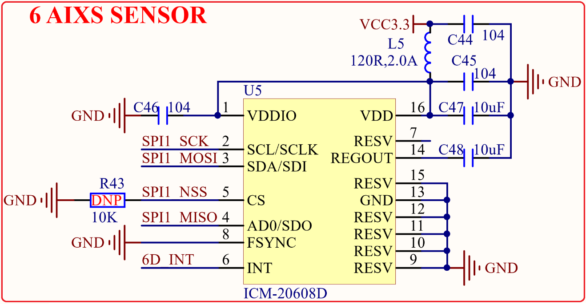

# 1.3.14 六轴传感器

&emsp;&emsp;STM32MP157开发板板载了一个六轴传感器，电路如图1.3.14.1所示：

 
图1.3.14.1 六轴传感器

&emsp;&emsp;六轴传感器芯片型号为：ICM20608，该芯片内部集成了：三轴加速度传感器和三轴陀螺仪，这里我们使用SPI接口来访问。

&emsp;&emsp;ICM20608支持IIC和SPI两种接口，STM32MP157开发板使用SPI接口，目的是为了在开发板上放一个SPI外设，学习Linux下的SPI驱动开发(因为笔者购买过很多Linux开发板，发现基本都没有SPI外设，不方便学习SPI驱动)。ICM20608通过SPI接口连接到STM32MP157的SPI1接口上，SCLK、SDI、CS和SDO分别连接到STM32MP157的PZ0(SPI1_SCK)、PZ2(SPI1_MOSI)、PZ3(SPI1_NSS)和PZ1(SPI1_MISO)。

