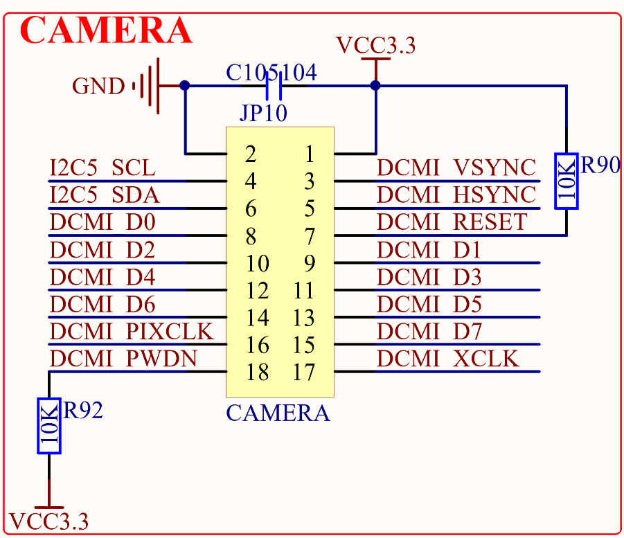

# 1.3.17 摄像头模块接口 

&emsp;&emsp;STM32MP157开发板板载了一个摄像头模块接口，连接在STM32MP157的硬件摄像头接口（DCMI）上面，其原理图如图1.3.17.1所示：

 
图1.3.17.1 摄像头模块接口

&emsp;&emsp;图中JP10接口可以用来连接正点原子摄像头模块。其中，I2C5_SCL和I2C5_SDA是摄像头的SCCB接口，分辨连接在STM32MP157的PA11和PA12引脚上。DCMI_RESET 和DCMI_PWDN这2个信号是不属于STM32MP157硬件摄像头接口的信号，通过普通IO控制即可，分别接在STM32MP157的PE1和PE11这两个引脚上。

&emsp;&emsp;此外，DCMI_VSYNC/DCMI_HSYNC/DCMI_D0~DCMI_D7/DCMI_PIXCLK等信号接在了STM32MP157的硬件摄像头接口。 

