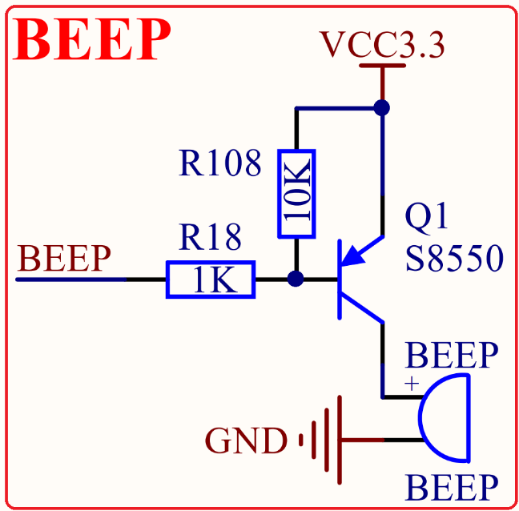

# 1.3.18 有源蜂鸣器 

&emsp;&emsp;STM32MP157开发板板载了一个有源蜂鸣器，其原理图如图1.3.18.1所示：

 
图1.3.18.1 有源蜂鸣器

&emsp;&emsp;有源蜂鸣器是指自带了震荡电路的蜂鸣器，这种蜂鸣器一接上电就会自己震荡发声。而如果是无源蜂鸣器，则需要外加一定频率（2~5Khz）的驱动信号，才会发声。这里我们选择使用有源蜂鸣器，方便大家使用。

&emsp;&emsp;BEEP信号直接连接在STM32MP157的PC7引脚上，可以通过控制此引脚来控制蜂鸣器开关。

