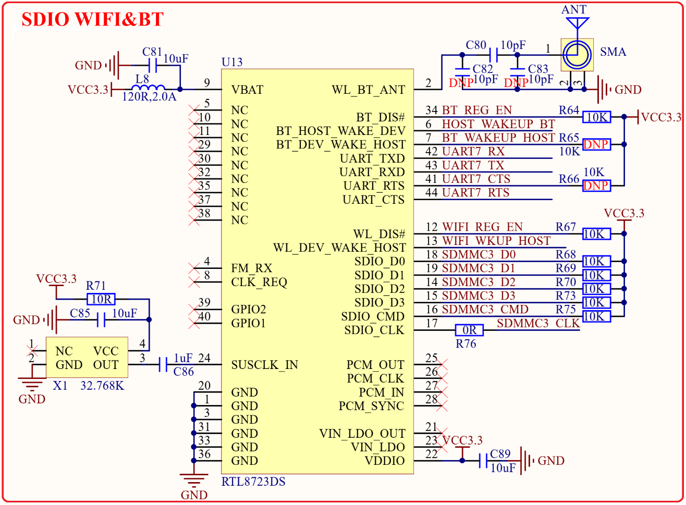

# 1.3.20 SDIO WIFI&蓝牙模块 

&emsp;&emsp;STM32MP157开发板板载一个SDIO WIFI&蓝牙模块，如图1.3.20.1所示：

 
图1.3.20.1 SDIO WIFI&蓝牙接口

&emsp;&emsp;WIFI&蓝模块使用RTL8723DS，这是一个SDIO接口的WIFI&蓝牙模块，连接到了STM32MP157的SDMMC3接口上，SDMMC3_D0~D3/CMD/CLK分别连接到了STM32MP157的PF0/PF4/PF5/PD7/PF1/PG15引脚上。蓝牙部分使用到了串口，模块的UART_TXD/UART_RXD/UART_RTS/UART_CTS连接到了STM32MP157的UART7串口上，对应的引脚为PF6/PF7/PF9/PF8。BT_REG_EN/HOST_WAKEUP_BT/BT_WAKEUP_HOST/WIFI_REG_EN/WIFI_WKUP_HOST这5个IO连接到了STM32MP157的PF10/PI11/PA13/PF13/PG1这5个引脚上。

