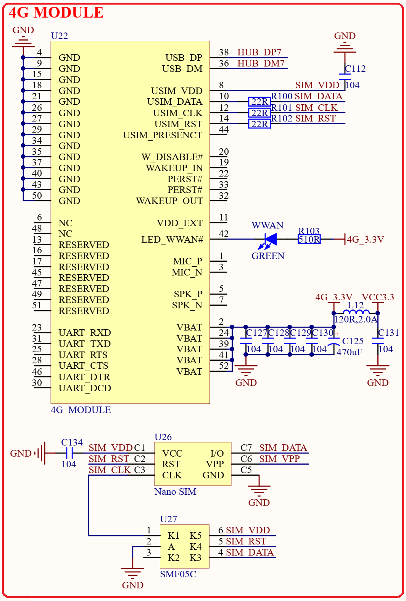

# 1.3.21 4G模块接口 

&emsp;&emsp;STM32MP157开发板板载4G Mini PCIE接口，如图1.3.21.1所示：

 
图1.3.21.1 4G模块

&emsp;&emsp;U22就是Mini PCIE接口的4G模块座子，用于连接Mini PCIE接口的4G模块，比如高新兴的ME3630模块。U26是Nano SIM卡座，用于插入Nano SIM卡。4G模块虽然采用Mini PCIE接口，但是实际走的USB接口，这里连接到了FE2.1扩展出来的一个USB HOST接口上(USB_HUB7)。

