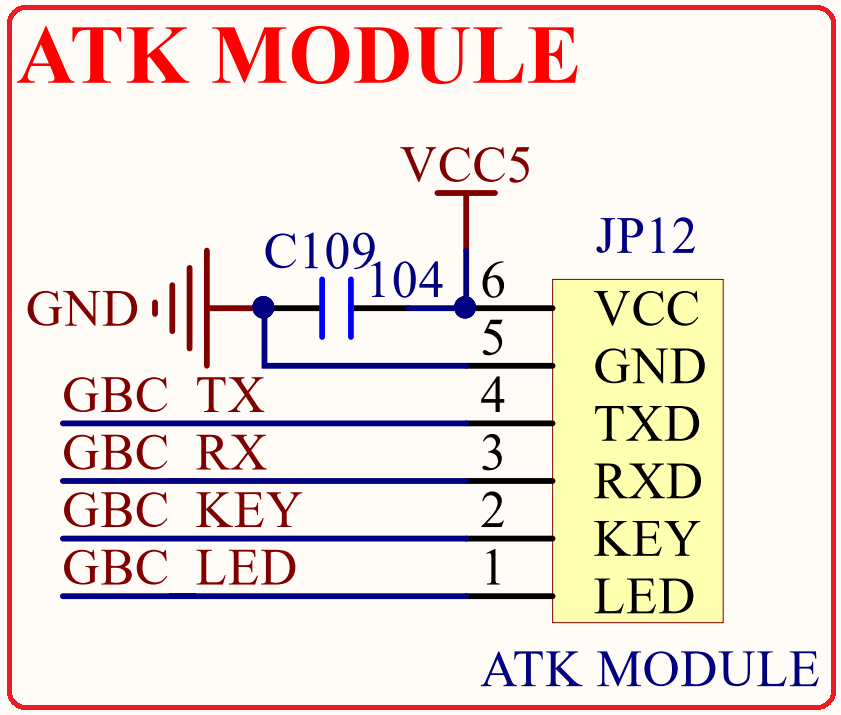

# 1.3.22 ATK模块接口

&emsp;&emsp;STM32MP157开发板板载了ATK模块接口，其原理图如图1.3.22.1所示：

 
图1.3.22.1 ATK模块接口

&emsp;&emsp;如图所示，JP12是一个1*6的排座，可以用来连接正点原子推出的一些模块，比如：蓝牙串口模块、GPS模块、MPU6050模块、激光测距模块、手势识别模块和RGB彩灯模块等。有了这个接口，我们连接模块就非常简单，插上即可工作。

&emsp;&emsp;图中：GBC_TX/GBC_RX连接到了STM32MP157的UART5上，和RS232母头共用一个串口，通过JP5跳线帽选择USART5是连接到ATK模块还是RS232母头上。

