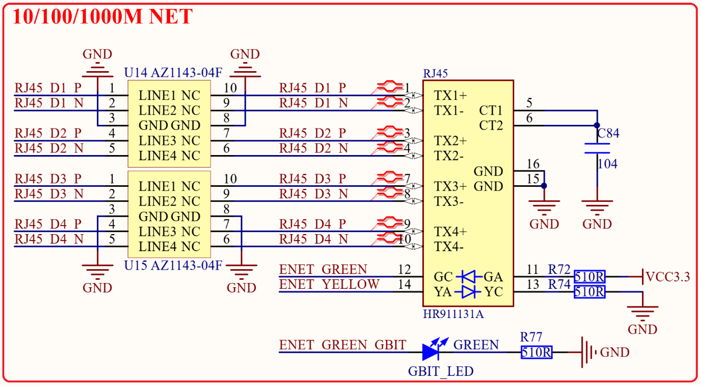

# 1.3.23 千M以太网接口（RJ45）  

&emsp;&emsp;STM32MP157开发板板载了1个千M以太网接口(RJ45)，网络PHY芯片在核心板上，因此底板PCB只需要绘制RJ45部分即可，原理图如图1.3.23.1所示：

 
图1.3.23.1 千M网络原理图 

&emsp;&emsp;STM32MP157内部自带1个千M网络MAC控制器，因此可以提供一个千M网口，网络PHY芯片RTL8211F放到了核心板上，核心板引出8根数据线以及3根LED信号线，方便用户设计底板。图1.3.23.1中RJ45_D1_P~RJ45_D4_P是4组共8根数据线，由核心板的PHY芯片提供。ENET_GREEN、ENET_YELLOW和ENET_GREEN_GBIT是三根LED灯控制引脚，也是PHY芯片提供的。GBIT_LED是一个绿色的LED灯，由ENET_GREEN_GBIT控制，如果网络工作在千M的时候此LED灯就会闪烁。

