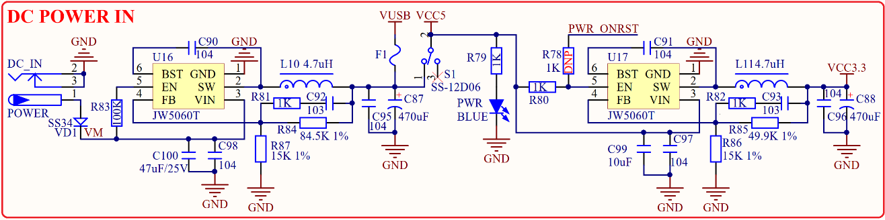

# 1.3.25 电源   

&emsp;&emsp;STM32MP157开发板板载的电源供电部分，其原理图如图1.3.25.1所示：

 
图1.3.25.1 电源

&emsp;&emsp;图中，总共有2个稳压芯片：U16/U17，DC_IN用于外部直流电源输入，经过U16 DC-DC芯片转换为5V电源输出，其中VD1是防反接二极管，避免外部直流电源极性搞错的时候，烧坏开发板。S1为开发板的总电源开关，F1为2A自恢复保险丝，用于保护USB。U17为3.3V稳压芯片，给开发板提供3.3V电源。 

&emsp;&emsp;这里还有USB供电部分没有列出来，其中VUSB就是来自USB供电部分，详见1.3.27节。

